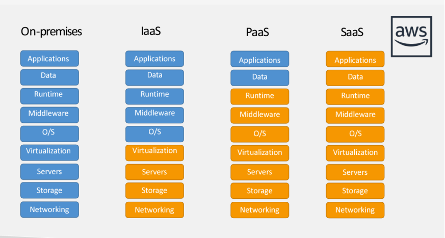
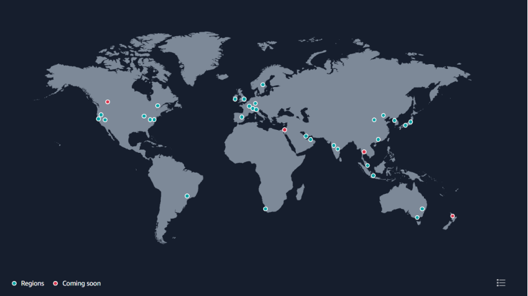
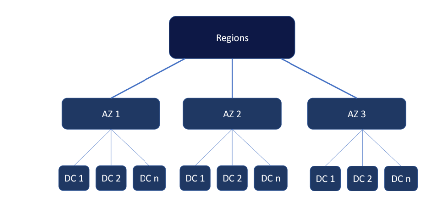

# AWS

---
### What is Cloud computing...?
Cloud computing is on-demand delivery of required service to the IT resource.
### Types of Clouds
1.Public cloud
2.Private cloud
3.Hybrid cloud

### 1)Public cloud
Third party providers

Ex :- AWS, Azure, Google

### 2)Private cloud
Cloud services used by single organisation, not exposed to public

Ex:-cisco, Dell

### 3)Hybrid Cloud
Keep some servers on premise and extend some capability to the cloud
Ex:-
### Benefits of Cloud
* **Flexibility** – Change resource type when needed
* **Cost-effectiveness** – Pay as you go, For what you use
* **Scalability** – Accommodate larger loads by making hardware stronger or adding additional nodes
* **Elasticity** – Ability to scale out and scale in
* **High – ability and fault tolerance** – build across data centres
* **Agility** – rapidly develop, test and launch software applications

### Types of cloud computing
1. Infrastructure as a service(IaaS)
   * Similar to On premises Infrastructure
   * Highest level of flexibility
   
     Ex : EC2
2. Platform as a service(PaaS)
   * No need to maintain infrastructure 
   * Focus on the deployment and management of your applications
     Ex:-Elastic beanstalk
3. Software as a service(SaaS)
   * No need to maintain infrastructure and application
   
     Ex:- Dynamo DB, zoom, Google

### AWS global infrastructure

* I. North America
* II.South America
* III.Africa
* IV.Middle east
* V.Acia pacific
* VI.Europe
* VII.Australia and New Zealand

