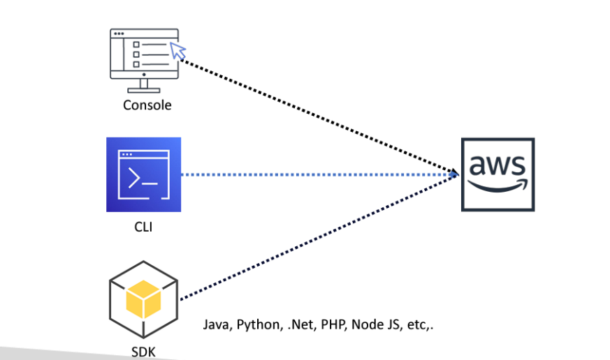

# AWS Best practice

---
### Best practice for root account
* Set MFA hands-on
* Never share your root account password or access key
* Use strong password policy
* Create users to perform tasks
* Don’t create access key for root account

### Different ways to connect AWS account
To access AWS, you have three options:
1. **AWS Management Console (protected by password + MFA)**
2. **AWS Command Line Interface (CLI)**:protected by access keys
3. **AWS Software Developer Kit (SDK)**-for code: protected by access keys

>[!NOTE]
>
>Access Keys are secret, just like a password. Don’t share them
>
>1.Access Key ID ~= username
>
>2.Secret Access Key ~= password

### AWS CLI
* Command Line Interface
* A tool that enables you to interact with AWS services using commands in your command-line shell
* Direct access to the public APIs of AWS services

### AWS SDK
* Software development kit
* Enables you to access and manage AWS services programmatically
* Language-specific APIs
* SDKs (JavaScript, Python, PHP, .NET, Ruby, Java, Go, Node.js, C++)
* AWS CLI is built on AWS SDK for Python
