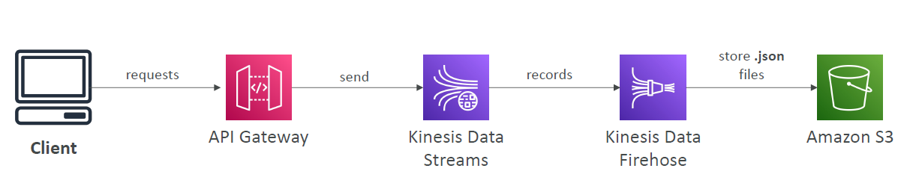

# AWS API Gateway

---
* AWS Lambda + API Gateway: No infrastructure to manage
* Support for the WebSocket Protocol
* Handle API versioning (v1, v2…)
* Handle different environments (dev, test, prod…)
* Handle security (Authentication and Authorization)
* Create API keys, handle request throttling
* Swagger / Open API import to quickly define APIs
* Transform and validate requests and responses
* Generate SDK and API specifications
* Cache API responses
### API Gateway – Integrations High Level
* Lambda Function
  * Invoke Lambda function
  * Easy way to expose REST API backed by AWS Lambda
* HTTP
  * Expose HTTP endpoints in the backend
  * Example: internal HTTP API on premise, Application Load Balancer…
  * Why? Add rate limiting, caching, user authentications, API keys, etc…
* AWS Service
  * Expose any AWS API through the API Gateway
  * Example: start an AWS Step Function workflow, post a message to SQS
  * Why? Add authentication, deploy publicly, rate control…
### API Gateway – AWS Service Integration Kinesis Data Streams example

### API Gateway - Endpoint Types
• Edge-Optimized (default): For global clients
• Requests are routed through the CloudFront Edge locations (improves latency)
• The API Gateway still lives in only one region
• Regional:
• For clients within the same region
• Could manually combine with CloudFront (more control over the caching
strategies and the distribution)
• Private:
• Can only be accessed from your VPC using an interface VPC endpoint (ENI)
• Use a resource policy to define access