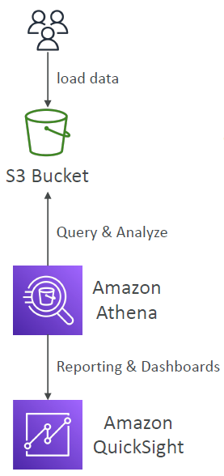

# AWS Athena

---

* Serverless query service to analyze data stored in Amazon S3
* Uses standard SQL language to query the files (built on Presto)
* Supports CSV, JSON, ORC, Avro, and Parquet
* Pricing: $5.00 per TB of data scanned
* Commonly used with Amazon Quicksight for reporting/dashboards
* Use cases: Business intelligence / analytics / reporting, analyze & query VPC Flow Logs, ELB Logs, CloudTrail trails, etc...
* Exam Tip: analyze data in S3 using serverless SQL, use Athena
### Amazon Athena – Performance Improvement
* Use columnar data for cost-savings (less scan)
  * Apache Parquet or ORC is recommended
  * Huge performance improvement
  * Use Glue to convert your data to Parquet or ORC
* Compress data for smaller retrievals (bzip2, gzip, lz4, snappy, zlip, zstd…)
* Partition datasets in S3 for easy querying on virtual columns
  * s3://yourBucket/pathToTable
    * /<PARTITION_COLUMN_NAME>=<VALUE>
      * /<PARTITION_COLUMN_NAME>=<VALUE>
        * /<PARTITION_COLUMN_NAME>=<VALUE>
          * /etc…
* Example: s3://athena-examples/flight/parquet/year=1991/month=1/day=1/
* Use larger files (> 128 MB) to minimize overhead