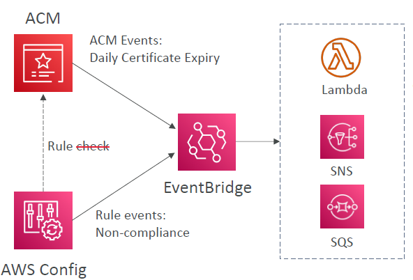
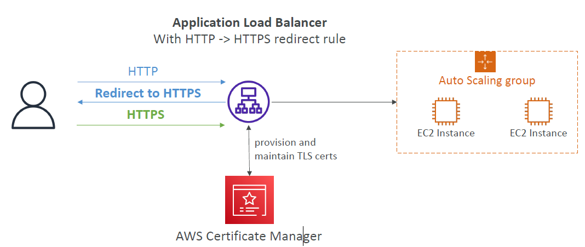

# AWS Certificate Manager (ACM)

---
### AWS Certificate Manager (ACM)

* Easily provision, manage, and deploy TLS Certificates
* Provide in-flight encryption for websites (HTTPS)
* Supports both public and private TLS certificates
* Free of charge for public TLS certificates
* Automatic TLS certificate renewal
* Integrations with (load TLS certificates on)
  * Elastic Load Balancers (CLB, ALB, NLB)
  * CloudFront Distributions
  * APIs on API Gateway
* Cannot use ACM with EC2 (can’t be extracted)
### ACM – Requesting Public Certificates
1. List domain names to be included in the certificate
   * Fully Qualified Domain Name (FQDN): corp.example.com
   * Wildcard Domain: *.example.com
2. Select Validation Method: DNS Validation or Email validation
   * DNS Validation is preferred for automation purposes
   * Email validation will send emails to contact addresses in the WHOIS database
   * DNS Validation will leverage a CNAME record to DNS config (ex: Route 53)
3. It will take a few hours to get verified
4. The Public Certificate will be enrolled for automatic renewal
   * ACM automatically renews ACM-generated certificates 60 days before expiry
### ACM Importing public certificate ACM – Importing Public Certificates

* Option to generate the certificate outside of ACM and then import it
* No automatic renewal, must import a new certificate before expiry
* ACM sends daily expiration events starting 45 days prior to expiration
* The # of days can be configured
* Events are appearing in EventBridge
* AWS Config has a managed rule named acm-certificate-expiration-check to check for expiring certificates(configurable number of days)
### ACM – Integration with ALB Auto

### API Gateway - Endpoint Types
* Edge-Optimized (default): For global clients
  * Requests are routed through the CloudFront Edge locations (improves latency)
  * The API Gateway still lives in only one region
* Regional:
  * For clients within the same region
  * Could manually combine with CloudFront (more control over the caching strategies and the distribution)
* Private:
  * Can only be accessed from your VPC using an interface VPC endpoint (ENI)
  * Use a resource policy to define access