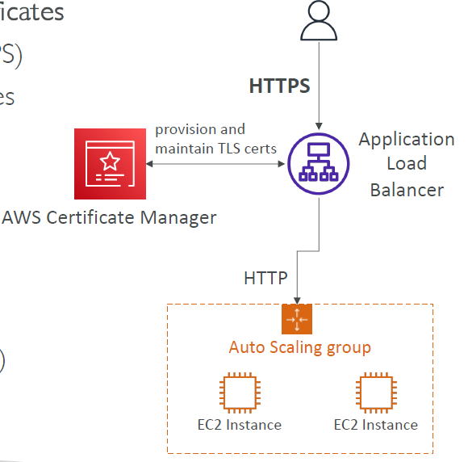

# AWS Certificate Manager (ACM)

---
### AWS Certificate Manager (ACM)

* Easily provision, manage, and deploy TLS Certificates
* Provide in-flight encryption for websites (HTTPS)
* Supports both public and private TLS certificates
* Free of charge for public TLS certificates
* Automatic TLS certificate renewal
* Integrations with (load TLS certificates on)
  * Elastic Load Balancers (CLB, ALB, NLB)
  * CloudFront Distributions
  * APIs on API Gateway
* Cannot use ACM with EC2 (can’t be extracted)
### ACM – Requesting Public Certificates
1. List domain names to be included in the certificate
   * Fully Qualified Domain Name (FQDN): corp.example.com
   * Wildcard Domain: *.example.com
2. Select Validation Method: DNS Validation or Email validation
   * DNS Validation is preferred for automation purposes
   * Email validation will send emails to contact addresses in the WHOIS database
   * DNS Validation will leverage a CNAME record to DNS config (ex: Route 53)
3. It will take a few hours to get verified
4. The Public Certificate will be enrolled for automatic renewal
   * ACM automatically renews ACM-generated certificates 60 days before expiry