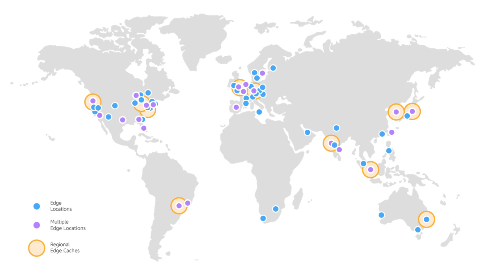
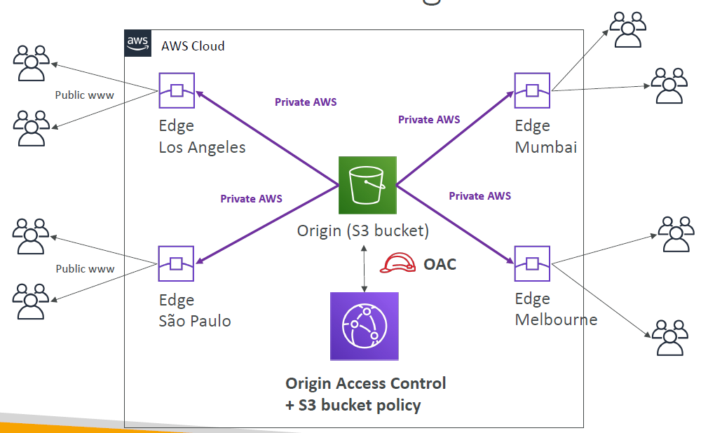
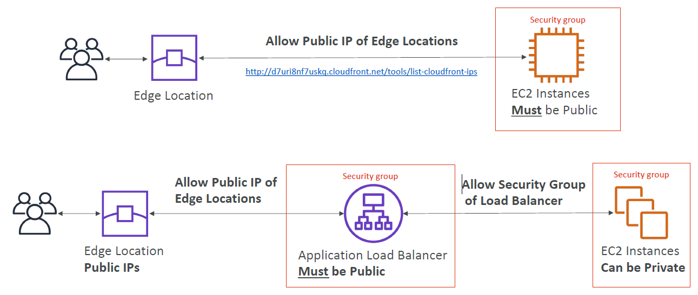
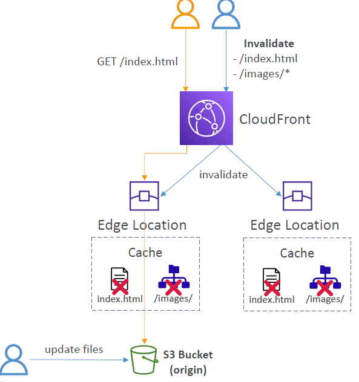
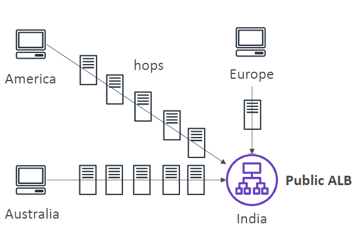

# Amazon CloudFront

---

* Content Delivery Network (CDN)
* Improves read performance,content is cached at the edge
* Improves users experience
* 216 Point of Presence globally (edge locations)
* DDoS protection (because worldwide), integration with Shield,AWS Web Application Firewall
### S3 bucket
* For distributing files and caching them at the edge
* Enhanced security with CloudFront Origin Access Control (OAC)
* OAC is replacing Origin Access Identity (OAI)
* CloudFront can be used as an ingress (to upload files to S3)
### Custom Origin (HTTP)
* Application Load Balancer
* EC2 instance
* S3 website (must first enable the bucket as a static S3 website)
* Any HTTP backend you want
### CloudFront vs S3 Cross Region Replication

* CloudFront:
  * Global Edge network
  * Files are cached for a TTL (maybe a day)
  * Great for static content that must be available everywhere
* S3 Cross Region Replication:
  * Must be setup for each region you want replication to happen
  * Files are updated in near real-time
  * Read only
  * Great for dynamic content that needs to be available at low-latency in few regions
### CloudFront – ALB or EC2 as an origin

### CloudFront Geo Restriction
* You can restrict who can access your distribution
  * Allowlist: Allow your users to access your content only if they're in one of the countries on a list of approved countries.
  * Blocklist: Prevent your users from accessing your content if they're in one of the countries on a list of banned countries.
* The “country” is determined using a 3rd party Geo-IP database
* Use case: Copyright Laws to control access to content
## Pricing
* CloudFront Edge locations are all around the world
* The cost of data out per edge location varies
### Price Classes
* You can reduce the number of edge locations for cost reduction
* Three price classes:
  1. Price Class All: all regions – best performance
  2. Price Class 200: most regions, but excludes the most expensive regions
  3. Price Class 100: only the least expensive regions
### Cache Invalidations

* In case you update the back-end origin, CloudFront doesn’t know about it and will only get the refreshed content after the TTL has expired
* However, you can force an entire or partial cache refresh (thus bypassing the TTL) by performing a CloudFront Invalidation
* You can invalidate all files (*) or a special path (/images/*)
### Global users for our application

* You have deployed an application and have global users who want to access it directly.
* They go over the public internet, which can add a lot of latency due to many hops
* We wish to go as fast as possible through AWS network to minimize latency
### Unicast IP vs Anycast IP
* Unicast IP: one server holds one IP address
* Anycast IP: all servers hold the same IP address and the client is routed to the nearest one