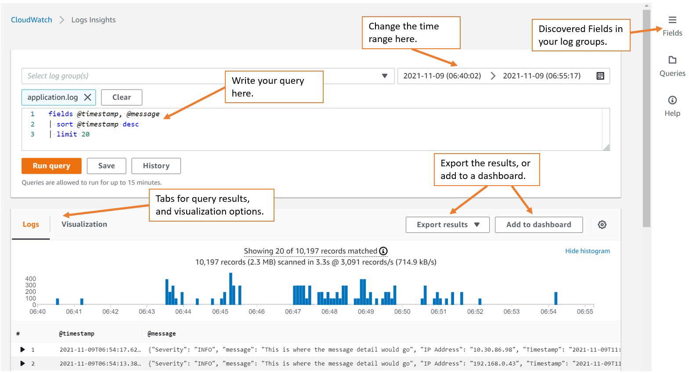
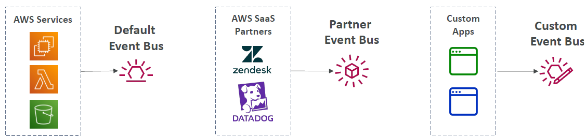

# AWS CloudWa

---
## Amazon CloudWatch Metrics
* CloudWatch provides metrics for every services in AWS
* Metric is a variable to monitor (CPUUtilization, NetworkIn…)
* Metrics belong to namespaces
* Dimension is an attribute of a metric (instance id, environment, etc…).
* Up to 30 dimensions per metric
* Metrics have timestamps
* Can create CloudWatch dashboards of metrics
* Can create CloudWatch Custom Metrics (for the RAM for example)
### CloudWatch Metric Streams

* Continually stream CloudWatch metrics to a destination of your choice, with near-real-time delivery and low latency.
  * Amazon Kinesis Data Firehose (and then its destinations)
  * 3rd party service provider: Datadog, Dynatrace, New Relic, Splunk, Sumo Logic…
* Option to filter metrics to only stream a subset of them
## CloudWatch Logs
* Log groups: arbitrary name, usually representing an application
* Log stream: instances within application / log files / containers
* Can define log expiration policies (never expire, 1 day to 10 years…)
* CloudWatch Logs can send logs to:
  * Amazon S3 (exports)
  * Kinesis Data Streams
  * Kinesis Data Firehose
  * AWS Lambda
  * OpenSearch
* Logs are encrypted by default
* Can setup KMS-based encryption with your own keys
### CloudWatch Logs - Sources
* SDK, CloudWatch Logs Agent, CloudWatch Unified Agent
* Elastic Beanstalk: collection of logs from application
* ECS: collection from containers
* AWS Lambda: collection from function logs
* VPC Flow Logs: VPC specific logs
* API Gateway
* CloudTrail based on filter
* Route53: Log DNS queries
### CloudWatch Logs Insights

* Search and analyze log data stored in CloudWatch Logs
* Example: find a specific IP inside a log, count occurrences of “ERROR” in your logs…
* Provides a purpose-built query language
  * Automatically discovers fields from AWS services and JSON log events
  * Fetch desired event fields, filter based on conditions, calculate aggregate statistics, sort events, limit number of events…
  * Can save queries and add them to CloudWatch Dashboards
* Can query multiple Log Groups in different AWS accounts
* It’s a query engine, not a real-time engine
### CloudWatch Container Insights

* Collect, aggregate, summarize metrics and logs from containers
* Available for containers on…
* Amazon Elastic Container Service (Amazon ECS)
* Amazon Elastic Kubernetes Services (Amazon EKS)
* Kubernetes platforms on EC2
* Fargate (both for ECS and EKS)
* In Amazon EKS and Kubernetes, CloudWatch Insights is using a containerized version of the CloudWatch Agent to discover containers
### CloudWatch Lambda Insights
* Monitoring and troubleshooting solution for serverless applications running on AWS Lambda
* Collects, aggregates, and summarizes system-level metrics including CPU time, memory, disk, and network
* Collects, aggregates, and summarizes diagnostic information such as cold starts and Lambda worker shutdowns
* Lambda Insights is provided as a Lambda Layer
### CloudWatch Logs – S3 Export

* Log data can take up to 12 hours to become available for export
* The API call is CreateExportTask
* Not near-real time or real-time… use Logs Subscriptions instead
### CloudWatch Logs Subscriptions

* Get a real-time log events from CloudWatch Logs for processing and analysis
* Send to Kinesis Data Streams, Kinesis Data Firehose, or Lambda
* Subscription Filter – filter which logs are events delivered to your destination
### CloudWatch Logs Aggregation Multi-Account & Multi Region

### CloudWatch Logs for EC2

* By default, no logs from your EC2 machine will go to CloudWatch
* You need to run a CloudWatch agent on EC2 to push the log files you want
* Make sure IAM permissions are correct
* The CloudWatch log agent can be setup on-premises too
### CloudWatch Logs Agent & Unified Agent
* For virtual servers (EC2 instances, on-premises servers…)
* **CloudWatch Logs Agent**
  * Old version of the agent
  * Can only send to CloudWatch Logs
* **CloudWatch Unified Agent**
  * Collect additional system-level metrics such as RAM, processes, etc…
  * Collect logs to send to CloudWatch Logs
  * Centralized configuration using SSM Parameter Store
### CloudWatch Unified Agent – Metrics
* Collected directly on your Linux server / EC2 instance
* CPU (active, guest, idle, system, user, steal)
* Disk metrics (free, used, total), Disk IO (writes, reads, bytes, iops)
* RAM (free, inactive, used, total, cached)
* Netstat (number of TCP and UDP connections, net packets, bytes)
* Processes (total, dead, bloqued, idle, running, sleep)
* Swap Space (free, used, used %)
* Reminder: out-of-the box metrics for EC2 – disk, CPU, network (high level)
## CloudWatch Alarms
* Alarms are used to trigger notifications for any metric
* Various options (sampling, %, max, min, etc…)
* Alarm States:
  * OK
  * INSUFFICIENT_DATA
  * ALARM
* Period:
  * Length of time in seconds to evaluate the metric
  * High resolution custom metrics: 10 sec, 30 sec or multiples of 60 sec
### CloudWatch Alarm Targets
* Stop, Terminate, Reboot, or Recover an EC2 Instance
* Trigger Auto Scaling Action
* Send notification to SNS (from which you can do pretty much anything)
### CloudWatch Alarms – Composite Alarms

* CloudWatch Alarms are on a single metric
* Composite Alarms are monitoring the states of multiple other alarms
* AND and OR conditions
* Helpful to reduce “alarm noise” by creating complex composite alarms
### CloudWatch Alarm: good to know

* Alarms can be created based on CloudWatch Logs Metrics Filters
* To test alarms and notifications, set the alarm state to Alarm using CLI aws cloudwatch set-alarm-state --alarm-name "myalarm" --state-value ALARM --state-reason "testing purposes"
### Amazon EventBridge(formerly CloudWatch Events)

### Amazon EventBridge Rules

### Amazon EventBridge

* Event buses can be accessed by other AWS accounts using Resource-based Policies
* You can archive events (all/filter) sent to an event bus (indefinitely or set period)
* Ability to replay archived events
### Amazon EventBridge – Schema Registry
* EventBridge can analyze the events in your bus and infer the schema
* The Schema Registry allows you to generate code for your application, that will know in advance how data is structured in the event bus
* Schema can be versioned
### Amazon EventBridge – Resource-based Policy

* Manage permissions for a specific Event Bus
* Example: allow/deny events from another AWS account or AWS region
* Use case: aggregate all events from your AWS Organization in a single AWS account or AWS region