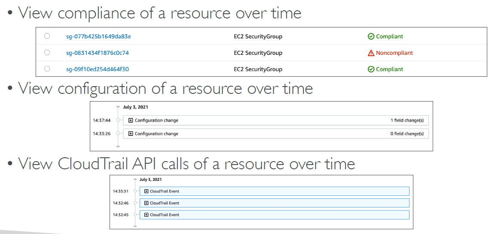
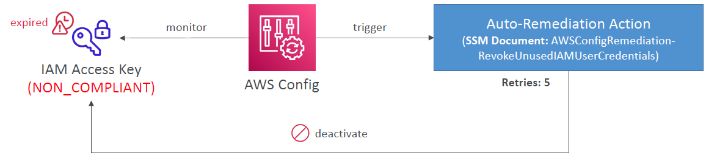
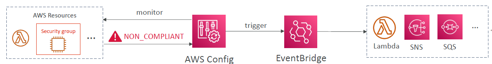
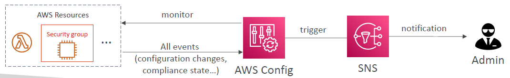

# AWS Config

---
* Helps with auditing and recording compliance of your AWS resources
* Helps record configurations and changes over time
* Questions that can be solved by AWS Config:
  * Is there unrestricted SSH access to my security groups?
  * Do my buckets have any public access?
  * How has my ALB configuration changed over time?
* You can receive alerts (SNS notifications) for any changes
* AWS Config is a per-region service
* Can be aggregated across regions and accounts
* Possibility of storing the configuration data into S3 (analyzed by Athena)
### Config Rules
* Can use AWS managed config rules (over 75)
* Can make custom config rules (must be defined in AWS Lambda)
  * Ex: evaluate if each EBS disk is of type gp2
  * Ex: evaluate if each EC2 instance is t2.micro
* Rules can be evaluated / triggered:
  * For each config change
  * And / or: at regular time intervals
* AWS Config Rules does not prevent actions from happening (no deny)
* Pricing: no free tier, $0.003 per configuration item recorded per region, $0.001 per config rule evaluation per region
### AWS Config Resource

### Config Rules – Remediations

* Automate remediation of non-compliant resources using SSM Automation Documents
* Use AWS-Managed Automation Documents or create custom Automation Documents
  * Tip: you can create custom Automation Documents that invokes Lambda function
* You can set Remediation Retries if the resource is still non-compliant after autoremediation
### Config Rules – Notifications
* Use EventBridge to trigger notifications when AWS resources are noncompliant

* Ability to send configuration changes and compliance state notifications to SNS (all events – use SNS Filtering or filter at client-side)
