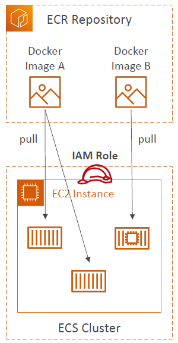
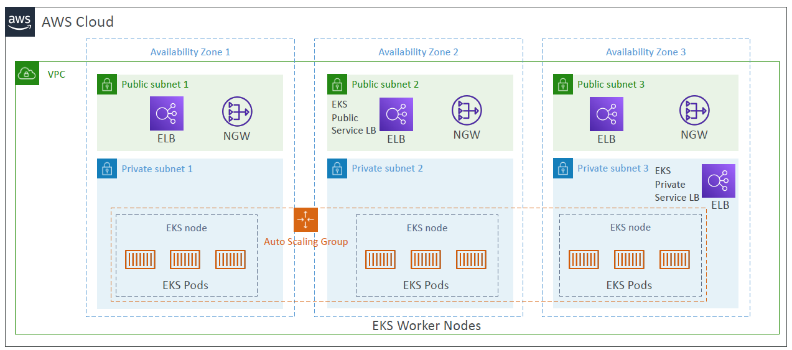

# AWS Docker

---
* Docker is a software development platform to deploy apps
* Apps are packaged in containers that can be run on any OS
* Apps run the same, regardless of where they’re run
  * Any machine
  * No compatibility issues
  * Predictable behavior
  * Less work
  * Easier to maintain and deploy
  * Works with any language, any OS, any technology
* Use cases: microservices architecture, lift-and-shift apps from onpremises to the AWS cloud, …
### Docker Containers Management on AWS
* Amazon Elastic Container Service (Amazon ECS)
  * Amazon’s own container platform
* Amazon Elastic Kubernetes Service (Amazon EKS)
  * Amazon’s managed Kubernetes (open source)
* AWS Fargate
  * Amazon’s own Serverless container platform
  * Works with ECS and with EKS
* Amazon ECR:
  * Store container images
## Amazon ECS
### Amazon ECS - EC2 Launch Type

* ECS = Elastic Container Service
* Launch Docker containers on AWS = Launch ECS Tasks on ECS Clusters
* EC2 Launch Type: you must provision & maintain the infrastructure (the EC2 instances)
* Each EC2 Instance must run the ECS Agent to register in the ECS Cluster
* AWS takes care of starting / stopping containers
### Amazon ECS – Fargate Launch Type

* Launch Docker containers on AWS
* You do not provision the infrastructure(no EC2 instances to manage)
* It’s all Serverless!
* You just create task definitions
* AWS just runs ECS Tasks for you based on the CPU / RAM you need
* To scale, just increase the number of tasks. Simple - no more EC2 instances
### Amazon ECS – IAM Roles for ECS

* EC2 Instance Profile (EC2 Launch Type only):
  * Used by the ECS agent
  * Makes API calls to ECS service
  * Send container logs to CloudWatch Logs
  * Pull Docker image from ECR
  * Reference sensitive data in Secrets Manager or SSM Parameter Store
* ECS Task Role:
  * Allows each task to have a specific role
  * Use different roles for the different ECS Services you run
  * Task Role is defined in the task definition
### Amazon ECS – Load Balancer Integrations

* Application Load Balancer supported and works for most use cases
* Network Load Balancer recommended only for high throughput / high performance use cases, or to pair it with AWS Private Link
* Classic Load Balancer supported but not recommended (no advanced features – no Fargate)
### Amazon ECS – Data Volumes (EFS)

* Mount EFS file systems onto ECS tasks
* Works for both EC2 and Fargate launch types
* Tasks running in any AZ will share the same data in the EFS file system
* Fargate + EFS = Serverless
* Use cases: persistent multi-AZ shared storage for your containers
* Note:
  * Amazon S3 cannot be mounted as a file system
### ECS Service Auto Scaling
* Automatically increase/decrease the desired number of ECS tasks
* Amazon ECS Auto Scaling uses AWS Application Auto Scaling
  * ECS Service Average CPU Utilization
  * ECS Service Average Memory Utilization - Scale on RAM
  * ALB Request Count Per Target – metric coming from the ALB
* **Target Tracking** – scale based on target value for a specific CloudWatch metric
* **Step Scaling** – scale based on a specified CloudWatch Alarm
* **Scheduled Scaling** – scale based on a specified date/time (predictable changes)
* ECS Service Auto Scaling (task level) ≠ EC2 Auto Scaling (EC2 instance level)
* Fargate Auto Scaling is much easier to setup (because Serverless)
### EC2 Launch Type – Auto Scaling EC2 Instances

* Accommodate ECS Service Scaling by adding underlying EC2 Instances
* Auto Scaling Group Scaling
  * Scale your ASG based on CPU Utilization
  * Add EC2 instances over time
* ECS Cluster Capacity Provider
  * Used to automatically provision and scale the infrastructure for your ECS Tasks
  * Capacity Provider paired with an Auto Scaling Group
  * Add EC2 Instances when you’re missing capacity (CPU, RAM…)
### ECS tasks invoked by Event Bridge

### ECS tasks invoked by Event Bridge Schedule

### ECS – SQS Queue Example

### ECS – Intercept Stopped Tasks using EventBridge

## Amazon ECR

* ECR = Elastic Container Registry
* Store and manage Docker images on AWS
* Private and Public repository (Amazon ECR Public Gallery https://gallery.ecr.aws)
* Fully integrated with ECS, backed by Amazon S3
* Access is controlled through IAM (permission errors => policy)
* Supports image vulnerability scanning, versioning, image tags, image lifecycle, …
## Amazon EKS

* Amazon EKS = Amazon Elastic Kubernetes Service
* It is a way to launch managed Kubernetes clusters on AWS
* Kubernetes is an open-source system for automatic deployment, scaling and management of containerized (usually Docker) application
* It’s an alternative to ECS, similar goal but different API
* EKS supports EC2 if you want to deploy worker nodes or Fargate to deploy serverless containers
* Use case: if your company is already using Kubernetes on-premises or in another cloud, and wants to migrate to AWS using Kubernetes
* Kubernetes is cloud-agnostic (can be used in any cloud – Azure, GCP…)
* For multiple regions, deploy one EKS cluster per region
* Collect logs and metrics using CloudWatch Container Insights
### Amazon EKS – Node Types
* Managed Node Groups
  * Creates and manages Nodes (EC2 instances) for you
  * Nodes are part of an ASG managed by EKS
  * Supports On-Demand or Spot Instances
* Self-Managed Nodes
  * Nodes created by you and registered to the EKS cluster and managed by an ASG
  * You can use prebuilt AMI - Amazon EKS Optimized AMI
  * Supports On-Demand or Spot Instances
* AWS Fargate
  * No maintenance required; no nodes managed
### Amazon EKS – Data Volumes
* Need to specify StorageClass manifest on your EKS cluster
* Leverages a Container Storage Interface (CSI) compliant driver
* Support for…
* Amazon EBS
* Amazon EFS (works with Fargate)
* Amazon FSx for Lustre
* Amazon FSx for NetApp ONTAP