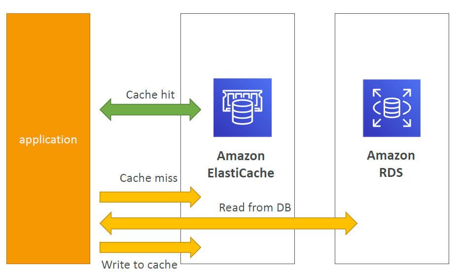
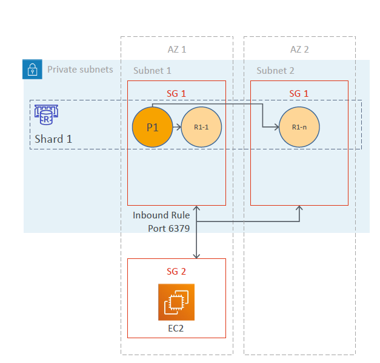
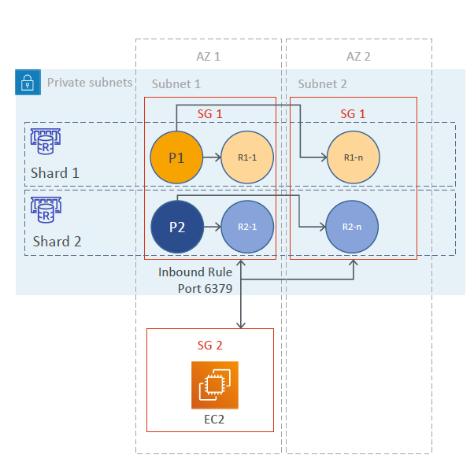
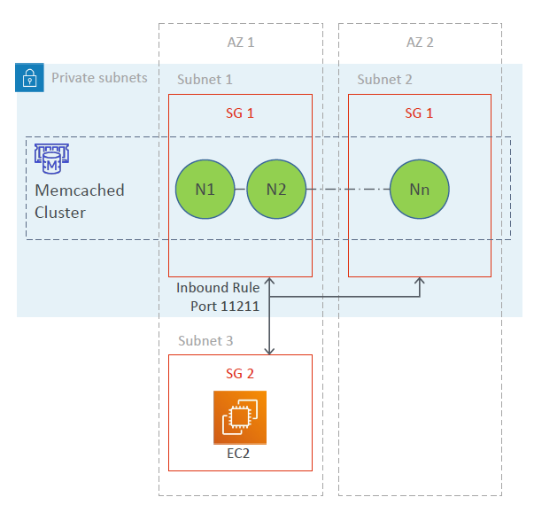

# ElastiCache

---
## Overview

* Fully-managed in-memory data store (caching service, to boost DB read performance)
* It is a remote caching service, or a side cache i.e. separate dedicated caching instance
* Provides rapid access to data across distributed nodes
* Two flavors (both are open-source key-value stores)
  * Amazon ElastiCache for Redis
  * Amazon ElastiCache for Memcached
* Sub-millisecond latency for real-time applications
* Redis supports complex data types, snapshots, replication, encryption, transactions,pub/sub messaging, transactional Lua scripting, and support for geospatial data
* Multithreaded architecture support with Memcached
* Redis suitable for complex applications including message queues, session caching,leaderboards etc.
* Memcached suitable for relatively simple applications like static website caching
* In-memory database offering high performance and low latency
* Can be put in front of databases such as RDS and DynamoDB
* ElastiCache nodes run on Amazon EC2 instances, so you must choose an instance family/type Instance
### Database caches

* Store frequently accessed data (read operations)
* Improve DB performance by taking the most read load off the DB
* Three types – integrated / local / remote caches
  1. Database integrated cache (stores data within DB)
     * Typically limited by available memory and resources
     * Example – Integrated cache in Aurora
     * integrated and managed cache with built-in write-through capabilities
     * enabled by default and no code changes needed
  2. Local cache (stores data within application)
  3. Remote cache (stores data on dedicated servers)
     * Typically built upon key/value NoSQL stores
     * Example – Redis and Memcached
     * Support up-to a million requests per second per cache node
     * Offer sub-millisecond latency
     * Caching of data and managing its validity is managed by your application
### Caching Strategies
1. Lazy loading – loads data into the cache only when necessary

   * Reactive approach
   * Only the queried data is cached (small size)
   * There is a cache miss penalty
   * Can contain stale data (use appropriate TTL)
2. Write through – loads data into the cache as it gets written to the DB

   * Proactive approach
   * Data is always current (never stale)
   * Results in cache churn (most data is never read, use TTL to save space)
3. Lazy loading with write through
   * Get the benefits of both strategies
   * Always use appropriate TTL

## Redis
### Cluster mode disabled

* Redis clusters are generally placed in private subnets
* Accessed from EC2 instance placed in a public subnet in a VPC
* Cluster mode disabled – single shard
* A shard has a primary node and 0-5 replicas
* A shard with replicas is also called as a replication group
* Replicas can be deployed as Multi-AZ
* Multi-AZ replicas support Auto-Failover capability
* Single reader endpoint (auto updates replica endpoint changes)
#### Scaling
* Vertical Scaling
  * scale up / scale down node type
  * minimal downtime
* Horizontal scaling
  * add / remove replica nodes
  * if Multi-AZ with automatic failover is enabled, you cannot remove the last replica
### Cluster mode enabled

* Cluster mode enabled – multiple shards
* Data is distributed across the available shards
* A shard has a primary node and 0-5 replicas
* Multi-AZ replicas support Auto-Failover capability
* Max 90 nodes per cluster (90 shards w/ no replicas to 15 shards w/ 5 replicas each)
* Minimum 3 shards recommended for HA
* Use nitro system-based node types for higher performance (e.g. M5 / R5 etc)
#### Scaling
* Vertical Scaling (Online)
  * scale up / scale down node type
  * no downtime
* Horizontal scaling (=resharding and shard rebalancing)
  * allows partitioning across shards
  * add / remove / rebalance shards
  * resharding = change the number of shards as needed
  * shard rebalancing = ensure that data is equally distributed across shards
  * two modes – offline (with downtime) and online (no downtime)

| Cluster Mode Disabled                                                                  | Cluster Mode Enabled                                                           | 
|----------------------------------------------------------------------------------------|--------------------------------------------------------------------------------|
| 1 shard                                                                                | Up to 90 shards                                                                |
| 0-5 replicas                                                                           | 0-5 replicas per shard                                                         |
| If 0 replicas, primary failure = total data loss                                       | If 0 replicas, primary failure = total data loss in that shard                 |
| Multi-AZ supported                                                                     | Multi-AZ required                                                              |
| Supports scaling                                                                       | Supports partitioning                                                          |
| If primary load is read-heavy, you can scale the cluster (though up to 5 replicas max) | Good for write-heavy nodes (you get additional write endpoints, one per shard) |
## Memcached 
### Overview
* Simple in-memory key-value store with sub-millisecond latency
* Automatic detection and recovery from cache node failures
* Typical applications
* Session store (persistent as well as transient session data store)
* DB query results caching (relational or NoSQL DBs – RDS / DynamoDB etc.)
* Webpage caching
* API caching
* Object caching (images / files / metadata)
* Well suited for web / mobile apps, gaming, IoT, ad-tech, and ecommerce
### Architecture

* Memcached cluster is generally placed in private subnet
* Accessed from EC2 instance placed in a public subnet in a VPC
* Allows access only from EC2 network (apps should be hosted on whitelisted EC2 instances)
* Whitelist using security groups
* Up to 20 nodes per cluster
* Data is distributed across the available nodes
* Replicas are not supported
* Node failure = data loss
* Nodes can be deployed as Multi-AZ (to reduce data loss)
### Scaling
* Vertical scaling not supported
  * can resize by creating a new cluster and migrating your application
* Horizontal scaling
  * allows you to partition your data across multiple nodes
  * up to 20 nodes per cluster and 100 nodes per region (soft limit)
  * no need to change endpoints post scaling(if you use auto-discovery)
  * must re-map at least some of your keyspace post scaling (evenly spread cache keys across all nodes)
## ElastiCache Security 
* Memcached does not support encryption
* Encryption at rest for Redis (using KMS)
* Encryption in-transit for Redis (using TLS / SSL)
  * Between server and client
  * Is an optional feature
  * Can have some performance impact
  * Supports encrypted replication
* Redis snapshots in S3 use S3’s encryption capabilities
### ElastiCache Use Cases
* Data that is relatively staticand frequently accessed
* Applications that are tolerant of stale data
* Data is slow and expensive to get compared to cache retrieval
* Require push-button scalability for memory, writes and reads
* Often used for storing session state