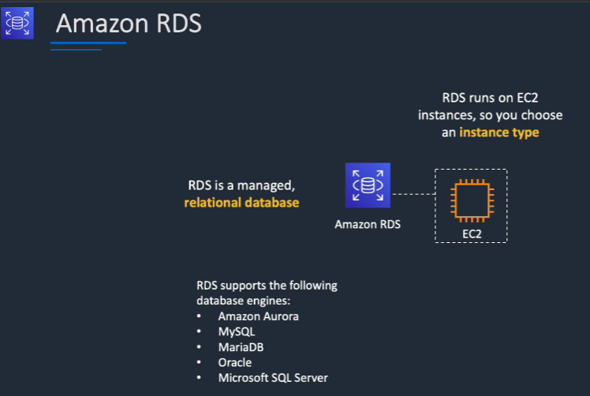
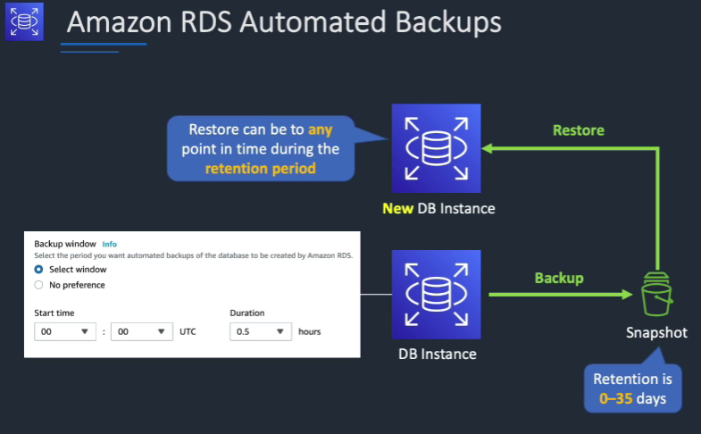
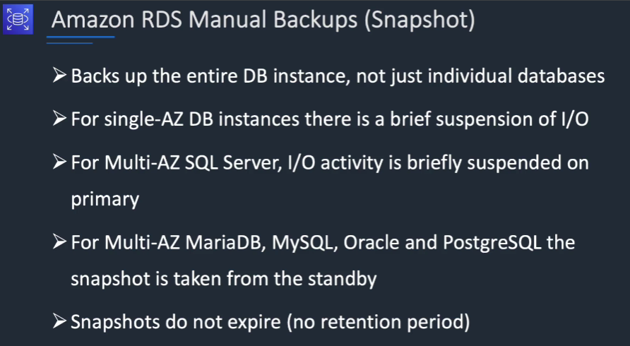
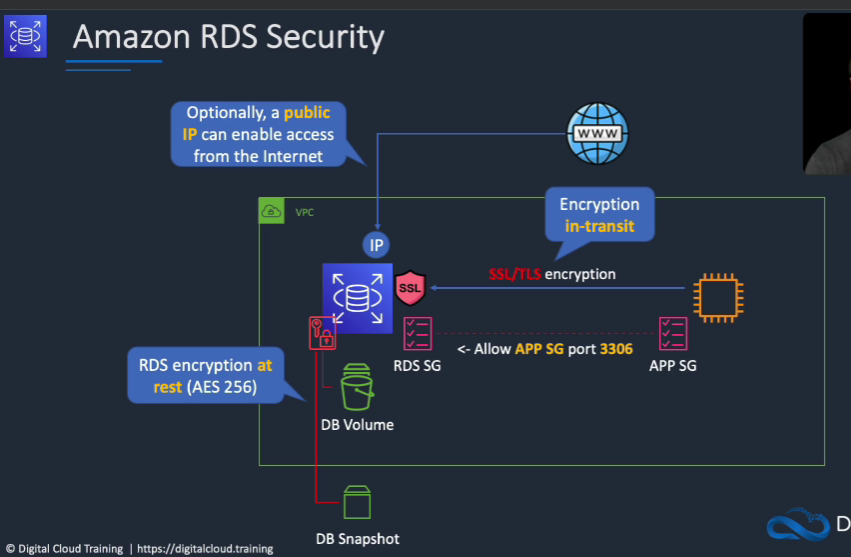
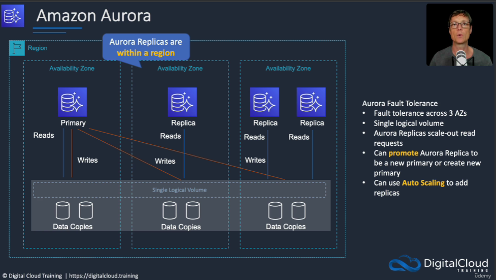
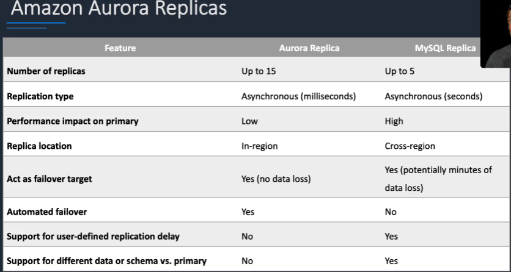

# RDS

---
## RDS

* RDS stands for Relational Database Service
* It’s a AWS managed DB service for Data Base use SQL as a query language.
* It allows you to create databases in the cloud that are managed by AWS
  * Postgres
  * MySQL
  * MariaDB
  * Oracle
  * Microsoft SQL Server
  * Aurora (AWS Proprietary database)
* Helps you increase storage on your RDS DB instance dynamically
* Useful for applications with unpredictable workloads
* Supports all RDS database engines (MariaDB, MySQL, PostgreSQL, SQL Server, Oracle)
* RDS instances run within a VPC with a private subnet, allowing users to control networking configurations.
* Underlying storage uses Amazon Elastic Block Store (gp2 or io1) volumes, similar to EC2.
* CloudWatch is utilized for monitoring RDS instances, providing performance charts, generating alarms, and enabling automated actions based on alarms.
* Backups: automated with point-in-time recovery. Backups expire
* Snapshots: manual, can make copies of snapshots cross region
### Why use RDS?
* When you self-host your DB, you manage everything
  * You manage hardware (physical infrastructure)
  * You manage software (OS)
  * You manage application (DB)
* When you host on AWS Cloud (on EC2, but not on RDS)
  * AWS manages hardware
  * You manage software (OS)
  * You manage application (DB)
* When you use RDS, AWS manages everything
  * AWS manages hardware
  * AWS manages software (OS)
  * AWS manages application (DB)

### Advantages on deploying RDS on EC2

* Automated provisioning, OS patching
* Continuous backups and restore to specific timestamp (Point in Time Restore)!

* Monitoring dashboards
* Read replicas for improved read performance
* Multi AZ setup for DR (Disaster Recovery)
* Maintenance windows for upgrades
* Scaling capability (vertical and horizontal)
* Storage backed by EBS (gp2 or io1)
>[!NOTE]
>
> BUT you can’t SSH into your underlying DB instances
### RDS Pricing Model
* When creating an RDS database, you choose:
  * Instance type (on-demand and reserved)
  * Engine type (PostgreSQL, MySQL, MariaDB, Oracle, Microsoft SQL Server, and Aurora)
  * DB instance class (based on memory, CPU and I/O capacity requirements)
* Uses pay as you go pricing model
* Instance types
  * On-demand (Pay for compute capacity per hour)
  * Reserved (deeply discounted, 1-year or 3-year term contract)
* Storage (GB/month) / Backups / Snapshot Export to S3
* I/O (per million requests)
### Choosing an Instance Class
* Instance class types
  * Standard
  * Memory-optimized (memory-intensive, high performance workloads)
  * Burstable performance
* Burstable performance instances
  * Can burst to higher level of CPU performance on demand depending
on the workload while providing baseline level performance at other
times
  * Managed through CPU credits (1 credit = 100% CPU Core utilization
for one min)
  * You get CPU credits when you use underutilize the CPU
### Storage Type
* General Purpose Storage (=cost-effective SSD storage)
  * You choose the storage size
  * You get a baseline of 3 IOPS/GB
  * Volumes below 1 TiB can burst to 3,000 IOPS (uses I/O credits)
  * Use with variable workloads
  * Typically used for small to medium sized DBs and in DEV/TEST environments
* Provisioned IOPS (=high-performance storage, recommended for production)
  * You choose storage size and required IOPS
  * Fast and predictable performance
  * Up to 32,000 IOPS max per DB instance
  * Use when consistent high IOPS are required (I/O-intensive workloads)
  * Well-suited for write-heavy workloads
* If instance runs out of storage, it may no longer be available until you allocate more storage (=> use storage autoscaling
### Storage Auto Scaling in RDS
* Both storage types (gp2 & io1) support storage autoscaling
* Dynamically scales up storage capacity based on workload
* Storage is scaled up automatically when the utilization nears the provisioned capacity
* Zero downtime
* You save costs due to over-provisioning and prevent downtime due to underprovisioning
* Use when workload is unpredictable
* You must set the max storage limit for storage autoscaling
### Read replica-> read scalability

* Up to 15 Read Replicas
* Within AZ, Cross AZ or Cross Region
* Replication is ASYNC, so reads are eventually consistent
* Replicas can be promoted to their own DB
* Applications must update the connection string to leverage read replicas
* For RDS Read Replicas within the same region, you don’t pay that fee
* Fail-over in case of loss of AZ, loss of network, instance or storage failure
### RDS security

* Launch within VPC to restrict internet access to the RDS instance
* You can’t change the VPC after creating the DB
* RDS databases are usually deployed within a private subnet, not in a public one
* RDS security works by leveraging security groups (the same concept as for EC2 instances)
* Use security groups to control access at DB, EC2 and VPC level
* Encryption at rest can be enabled –includes DB storage, backups, read replicas and snapshots
* You can only enable encryption for an Amazon RDS DB instance when you create it, not after the DB instance is created
* DB instances that are encrypted can't be modified to disable encryption
* Uses AES 256 encryption and encryption is transparent with minimal performance impact
* RDS for Oracle and SQL Server is also supported using Transparent Data Encryption (TDE) (may have performance impact)
* AWS KMS is used for managing encryption keys
* The same KMS key is used if in the same Region as the primary
* If the read replica is in a different Region, a different KMS key is used
* You can't restore an unencrypted backup or snapshot to an encrypted DB instance
* In-database user creation and permissions or manage through IAM
* Traditional Username and Password can be used to log in to the database
## AWS Aurora

* Aurora is a proprietary technology from AWS (not open sourced)
* Postgres and MySQL are both supported as Aurora DB (that means your drivers will work as if Aurora was a Postgres or MySQL database)
* Aurora is “AWS cloud optimized” and claims 5x performance improvement over MySQL on RDS, over 3x the performance of Postgres on RDS
* Aurora storage automatically grows in increments of 10GB, up to 128 TB.
* Aurora can have up to 15 replicas and the replication process is faster than MySQL (sub 10 ms replica lag)
* Failover in Aurora is instantaneous. It’s HA (High Availability) native.
* Aurora costs more than RDS (20% more) – but is more efficient
* One Aurora Instance takes writes (master)
* Support for Cross Region Replication
### Features of Aurora
* Automatic fail-over
* Backup and Recovery
* Isolation and security
* Industry compliance
* Push-button scaling 
* Automated Patching with Zero Downtime
* Advanced Monitoring
* Routine Maintenance
* Backtrack: restore data at any point of time without using backups
### Aurora vs SQl

