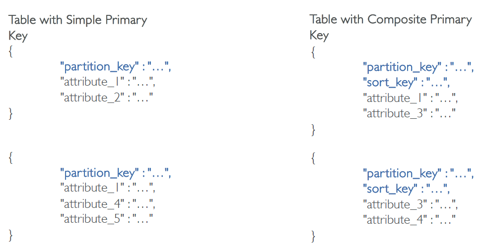
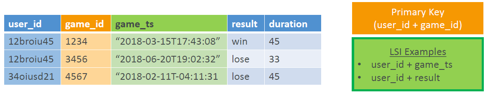
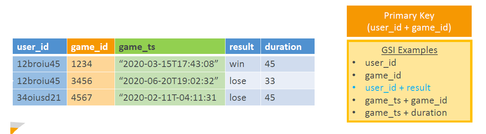
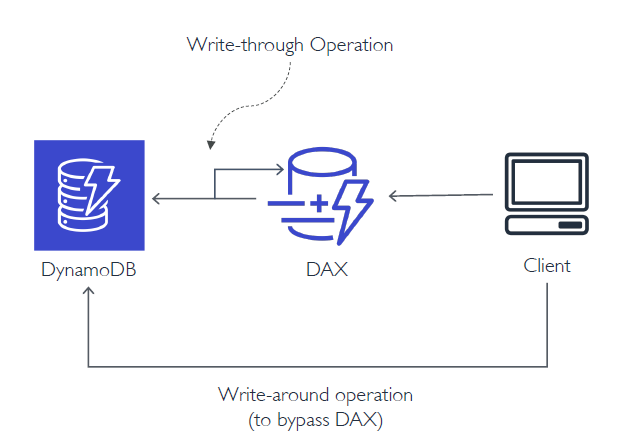

# DynamoDB

---
### Overview
* Non-relational Key-Value store
* Fully Managed, Serverless, NoSQL database in the cloud
* Fast, Flexible, Cost-effective, Fault Tolerant, Secure
* Multi-region, multi-master database (Global Tables)
* Backup and restore with PITR (Point-in-time Recovery)
* Single-digit millisecond performance at any scale
* In-memory caching with DAX (DynamoDB Accelerator, microsecond latency)
* Supports CRUD (Create/Read/Update/Delete) operations through APIs
* Supports transactions across multiple tables (ACID support)
* No direct analytical queries (No joins)
* Access patterns must be known ahead of time for efficient design and performance
### Terminology Compared to SQL
| SQL / RDBMS                             | DynamoDB                                                         |
|-----------------------------------------|------------------------------------------------------------------|
| Tables                                  | Tables                                                           |
| Rows                                    | Items                                                            |
| Columns                                 | Attributes                                                       |
| Primary Keys – Multicolumn and optional | Primary Keys – Mandatory, minimum one and maximum two attributes |
| Indexes                                 | Local Secondary Indexes                                          |
| Views                                   | Global Secondary Indexes                                         |
### DynamoDB Tables

* Tables are top-level entities
* No strict inter-table relationships (Independent Entities)
* You control performance at the table level
* Table items stored as JSON (DynamoDB-specific JSON)
* Primary keys are mandatory, rest of the schema is flexible
* Primary Key can be simple or composite
* Simple Key has a single attribute (=partition key or hash key)
* Composite Key has two attributes(=partition/hash key + sort/range key)
* Non-key attributes (including secondary key attributes) are optional
### Data Types in DynamoDB
1. Scalar Types
   * Exactly one value
   * e.g. string, number, binary, boolean, and null
   * Keys or index attributes only support string, number and binary scalar types
2. Set Types
   * Multiple scalar values
   * e.g. string set, number set and binary set
3. Document Types
   * Complex structure with nested attributes
   * e.g. list and map
### DynamoDB Consistency
* **Read Consistency**: strong consistency, eventual consistency, and transactional
* **Write Consistency**: standard and transactional
1. Strong Consistency
   * The most up-to-date data
   * Must be requested explicitly
   * If we read just after a write, we will get the correct data
2. Eventual Consistency
   * May or may not reflect the latest copy of data
   * Default consistency for all operations
   * 50% cheaper than strong consistency
   * If we read just after a write, it’s possible we’ll get unexpected response because of replication
3. Transactional Reads and Writes
   * For ACID support across one or more tables within a single AWS account and region
   * 2x the cost of strongly consistent reads
   * 2x the cost of standard writes
### DynamoDB Pricing Model
#### Provisioned Capacity
* You pay for the capacity you provision (= number of reads and writes per second)
* You can use auto-scaling to adjust the provisioned capacity
* Uses Capacity Units: Read Capacity Units (RCUs) and Write Capacity Units (WCUs)
* Consumption beyond provisioned capacity may result in throttling
* Use Reserved Capacity for discounts over 1 or 3-year term contracts (you’re charged a onetime fee + an houtly fee per 100 RCUs and WCUs)
* Uses Capacity Units
  * 1 capacity unit = 1 request/sec
* RCUs (Read Capacity Units)
  * In blocks of 4KB, last block always rounded up
  * 1 strongly consistent table read/sec = 1 RCU
  * 2 eventually consistent table reads/sec = 1 RCU
  * 1 transactional read/sec = 2 RCUs
* WCUs (Write Capacity Units)
  * In blocks of 1KB, last block always rounded up
  * 1 table write/sec = 1 WCU
  * 1 transactional write/sec = 2 WCUs
#### On-Demand Capacity
* You pay per request (= number of read and write requests your application makes)
* No need to provision capacity units
* DynamoDB instantly accommodates your workloads as they ramp up or down
* Uses Request Units: Read Request Units and Write Request Units
* Cannot use reserved capacity with On- Demand mode
* storage, backup, replication, streams, caching, data transfer out charged additionally
* Uses Request Units
  * Same as Capacity Units for calculation purposes
* Read Request Units
  * In blocks of 4KB, last block always rounded up
  * 1 strongly consistent table read request = 1 RRU
  * 2 eventually consistent table read request = 1 RRU
  * 1 transactional read request = 2 RRUs
* Write Request Units
  * In blocks of 1KB, last block always rounded up
  * 1 table write request = 1 WRU
  * 1 transactional write request = 2 WRUs

| Provisioned Capacity Mode                                                                    | On-Demand Capacity Mode                                                               |
|----------------------------------------------------------------------------------------------|---------------------------------------------------------------------------------------|
| Typically used in production environment                                                     | Typically used in dev/test environments or for small applications                     |
| Use this when you have predictable traffic                                                   | Use this when you have variable,unpredictable traffic                                 |
| Consider using reserved capacity if you have steady and predictable traffic for cost savings | Instantly accommodates up to 2x the previous peak traffic on a table                  |
| Can result in throttling when consumption shoots up (use auto-scaling)                       | Throttling can occur if you exceed 2x the previous peak within 30 minutes             |
| Tends to be cost-effective as compared to the on-demand capacity mode                        | Recommended to space traffic growth over at least 30 mins before driving more than 2x |
### Calculation
1. **Example 1:** Calculating Capacity Units

**Calculate capacity units to read and write a 15KB item**
* RCUs with strong consistency:
  * 15KB/4KB = 3.75 => rounded up => 4 RCUs
* RCUs with eventual consistency:
  * (1/2) x 4 RCUs = 2 RCUs
* RCUs for transactional read:
  * 2 x 4 RCUs = 8 RCUs
* WCUs:
  * 15KB/1KB = 15 WCUs
* WCUs for transactional write:
  * 2 x 15 WCUs = 30 WCUs

2. **Example 2:** Calculating Capacity Units

**Calculate capacity units to read and write a 1.5KB item**
  * RCUs with strong consistency:
    * 1.5KB/4KB = 0.375 => rounded up => 1 RCU
  * RCUs with eventual consistency:
    * (1/2) x 1 RCUs = 0.5 RCU => rounded up = 1 RCU
  * RCUs for transactional read:
    * 2 x 1 RCU = 2 RCUs
  * WCUs:
    * 1.5KB/1KB = 1.5 => rounded up => 2 WCUs
  * WCUs for transactional write:
    * 2 x 2 WCUs = 4 WCUs
3. **Example 3:** Calculating Throughput

**A DynamoDB table has provisioned capacity of 10 RCUs and 10 WCUs. Calculate the throughput that your application can support:**
  * Read throughput with strong consistency = 4KB x 10 = 40KB/sec
  * Read throughput (eventual) = 2 (40KB/sec) = 80KB/sec
  * Transactional read throughput = (1/2) x (40KB/sec)= 20KB/sec
  * Write throughput = 1KB x 10 = 10KB/sec
  * Transactional write throughput = (1/2) x (10KB/sec)= 5KB/sec
### DynamoDB LSI (Local Secondary Index)

* Can define up to 5 LSIs
* Has same partition/hash key attribute as the primary index of the table
* Has different sort/range key than the primary index of the table
* Must have a sort/range key (=composite key)
* Indexed items must be ≤ 10 GB
* Can only be created at the time of creating the table and cannot be deleted later
* Can only query single partition (specified by hash key)
* Support eventual / strong / transactional consistency
* Consumes provisioned throughput of the base table
* Can query any table attributes even if the attributes are not projected on to the index(can project all or up to 20 individual attributes)
### DynamoDB GSI (Global Secondary Index)

* Can define up to 20 GSIs (soft limit)
* Can have same or different partition/hash key than the table’s primary index
* Can have same or different sort/range key than the table’s primary index
* Can omit sort/range key (=simple and composite)
* No size restrictions for indexed items
* Can be created or deleted any time. Can delete only one GSI at a time
* Can query across partitions (over entire table)
* Support only eventual consistency
* Has its own provisioned throughput
* Can only query projected attributes (attributes included in the index)
## DynamoDB Partitions
* Store DynamoDB table data (physically)
* Each (physical) partition = 10GB SSD volume
* Not to be confused with table’s partition/hash key (which is a logical partition)
* One partition can store items with multiple partition keys
* A table can have multiple partitions
* Number of table partitions depend on its size and provisioned capacity
* Managed internally by DynamoDB
* Provisioned capacity is evenly distributed across table partitions
* Partitions once allocated, cannot be deallocated (important!)
### Calculating DynamoDB Partitions
* 1 partition = 1000 WCUs or 3000 RCUs (Maximum supported throughput per partition)
* 1 partition = 10GB of data
* No. of Partitions = Either the number of partitions based on throughput or the number of partitions based on size, whichever is higher
* PT = Round up [ (RCUs / 3000) + (WCUs / 1000) ]
* PS = Round up [ (Storage Required in GB / 10 GB) ]
* P = max (PT, PS)
#### Partition Behavior Example (Scaling up Storage)
* Provisioned Capacity = 1000 RCUs and 500 WCUs
* Storage size = 5 GB
```markdown
PT = Round up [ (1000 / 3000) + (500 / 1000) ]
   = Round up [ 0.67 ]
PT = 1

PS = Round up [ (5 GB / 10 GB) ]
PS = Round up [ 0.5 ]
PS = 1
P = max (1, 1)
P = 1
```
### DynamoDB Scaling
* You can manually scale up provisioned capacity as and when needed
* You can only scale down up to 4 times in a day
* Additional one scale down if no scale downs in last 4 hours
* Effectively 9 scale downs per day
* Scaling affects partition behavior
* Any increase in partitions on scale up will not result in decrease on scale down (Important!)
* Partitions once allocated will not get deallocated later
* No additional costs, uses AWS Application Auto Scaling service
* You set the desired target utilization, minimum and maximum provisioned capacity
#### DynamoDB Scaling Behavior
* Say, we want to migrate a 5 GB SQL database to DynamoDB
* Provisioned Capacity needed during BAU is 1000 RCUs and 500 WCUs
* To speed up the migration, we scale up the write capacity temporarily to 5000 WCUs
```commandline
PS = Round up [ (5 GB / 10 GB) ]
PS = Round up [ 0.5 ]
PS = 1
PT = Round up [ (1000 / 3000) + (5000 / 1000) ]
= Round up [ 5.33 ]
PT = 6
P = max (1, 6)
P = 6
```
### DynamoDB Operations
1. Table Cleanup:
   * Option 1: Scan + Delete => very slow, expensive, consumes RCU & WCU
   * Option 2: Drop Table + Recreate table =>fast, cheaper, efficient
2. Copying a DynamoDB Table:
   * Option 1: Use AWS DataPipeline (uses EMR)
   * Option 2: Create a backup and restore the backup into a new table name (can take some time)
   * Option 3: Scan + Write => write own code
### DynamoDB Accelerator (DAX)
* In-Memory Caching, microsecond latency
* Sits between DynamoDB and Client Application (acts a proxy)
* Saves costs due to reduced read load on DynamoDB
* Helps prevent hot partitions
* Minimal code changes required to add DAX to your existing DynamoDB app
* Supports only eventual consistency (strong consistency requests passthrough to DynamoDB)
* Not for write-heavy applications
* Runs inside the VPC
* Multi AZ (3 nodes minimum recommended for production)
* Secure (Encryption at rest with KMS, VPC, IAM, CloudTrail…)DAX
### DAX architecture
* DAX has two types of caches (internally)
1. Item Cache
   * Item cache stores results of index reads (=GetItem and BatchGetItem)
   * Default TTL of 5 min (specified while creating DAX cluster)
   * When cache becomes full, older and less popular items get removed
2. Query Cache
   * Query cache stores results of Query and Scan operations
   * Default TTL of 5 min
   * Updates to the Item cache or to the underlying DynamoDB table do not invalidate the query cache. So, TTL value of the query cache should be chosen accordingly
### DAX Operations

* Only for item level operations
* Table level operations must be sent directly to DynamoDB
* Write Operations use write-through approach
  * Data is first written to DynamoDB and then to DAX, and write operation is considered as successful only if both writes are successful
* You can use write-around approach to bypass DAX, e.g. for writing large amount of data, you can write directly to DynamoDB (Item cache goes out of sync)
* For reads, if DAX has the data (=Cache hit), it’s simply returned without going through DynamoDB
* If DAX doesn’t have the data (=Cache miss), it’s returned from DynamoDB and updated in DAX on the master node
* Strongly consistent reads are served directly from DynamoDB and will not be updated in DAX.
### Backup and Restore in DynamoDB
* Automatically encrypted, cataloged and easily discoverable
* Highly Scalable - create or retain as many backups for tables of any size
* Backup operations complete in seconds
* Backups are consistent within seconds across thousands of partitions
* No provisioned capacity consumption
* Does not affect table performance or availability
* Backups are preserved regardless of table deletion
* Can backup within the same AWS region as the table
* Restores can be within same region or cross region
* Integrated with AWS Backup service (can create periodic backup plans)
* Periodic backups can be scheduled using Lambda and CloudWatch triggers
* Cannot overwrite an existing table during restore, restores can be done only to a new table (=new name)
* To retain the original table name, delete the existing table before running restore
* You can use IAM policies for access control
* Restored table gets the same provisioned RCUs/WCUs as the source table, as recorded at the time of backup
* PITR RPO = 5 minutes approx.
* PITR RTO can be longer as restore operation creates a new table
* What gets restored:
  * Table data
  * GSIs and LSIs (optional, you can choose)
  * Encryption settings (you can change)
  * Provisioned RCUs / WCUs (with values at the time when backup was created)
  * Billing mode (with value at the time when backup was created)
* What you must manually set up on the restored table:
  * Auto scaling policies, IAM policies
  * CloudWatch metrics and alarms
  * Stream and TTL settings
  * Tags
### Continuous Backups with PITR
* Restore table data to any second in the last 35 days!
* Priced per GB based on the table size
* If you disable PITR and re-enable it, the 35 days clock gets reset
* Works with unencrypted, encrypted tables as well as global tables
* Can be enabled on each local replica of a global table
* If you restore a table which is part of global tables, the restored table will be an independent table (won’t be a global table anymore!)
* Always restores data to a new table
* What cannot be restored
  * Stream settings
  * TTL options
  * Autoscaling config
  * PITR settings
  * Alarms and tags
* All PITR API calls get logged in CloudTrail
### DynamoDB Encryption
* Server-side Encryption at Rest
  * Enabled by default
  * Uses KMS
  * 256-bit AES Encryption
  * Can use AWS owned CMK, AWS managed CMK, or customer managed CMK
  * Encrypts primary key, secondary indexes, streams, global tables, backups and DAX clusters
* Encryption in transit
  * Use VPC endpoints for applications running in a VPC
  * Use TLS endpoints for encrypting data in transit
### DynamoDB Global Tables
* Automatic, Multi-Master, Active-Active, Cross-region replication
* Useful for low latency, DR purposes
* Near real-time replication (< 1 second replication lag)
* Eventual consistency for cross-region reads
* Strong consistency for same region reads
* “Last Writer Wins” approach for conflict resolution
* Transactions are ACID-compliant only in the region where write occurs originally
* To enable global tables for a table, the table must be empty across regions
* Only one replica per region
* Must enable DynamoDB Streams with New and Old Images
* Must have the same table name and primary keys across regions
* Recommended to use identical settings for table and indexes across regions