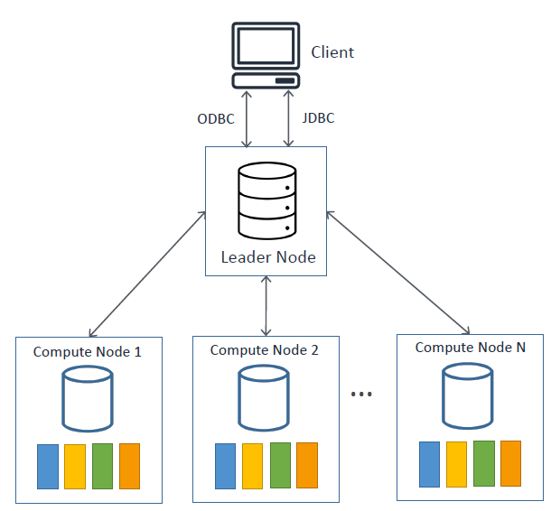
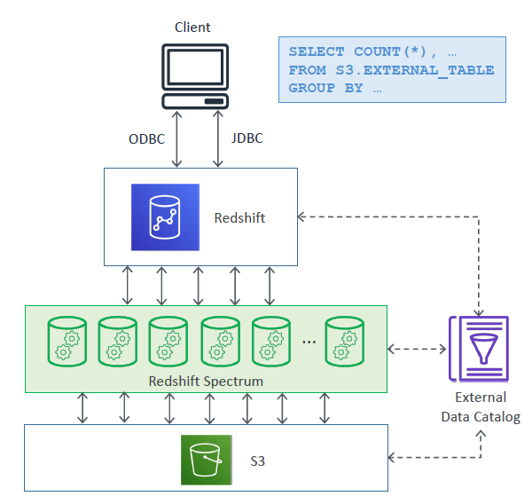
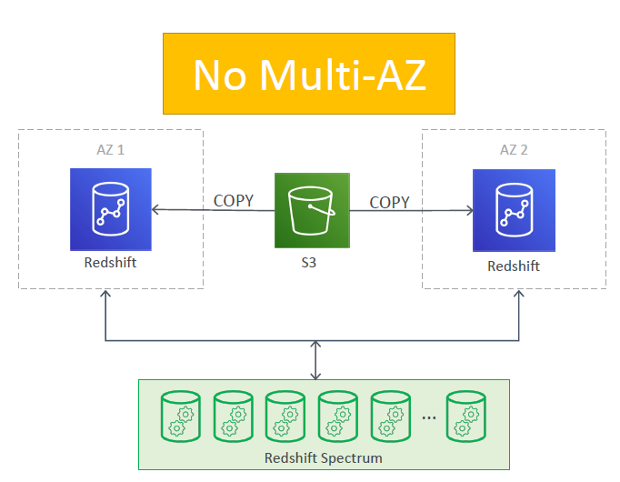
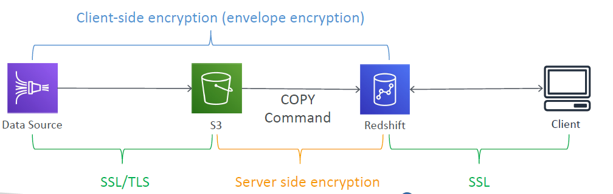

# Amazon Redshift

---
### Overview
* OLAP database (Data warehousing solution) based on PostgreSQL
* OLAP = Online Analytical Processing
* Can query petabytes of structured and semi-structured data across your data warehouse and your data lake using standard SQL
* 10x performance than other data warehouses
* Columnar storage of data (instead of row based)
* Massively Parallel Query Execution (MPP), highly available
* Has a SQL interface for performing the queries
* BI tools such as AWS Quicksight or Tableau integrate with it
* Data is loaded from S3, Kinesis Firehose, DynamoDB, DMS…
* Can contain from 1 node to 128 compute nodes, up to 160 GB per node
* Can provision multiple nodes, but it’s not Multi-AZ
* Leader node: for query planning, results aggregation
* Compute node: for performing the queries, send results to leader
* Backup & Restore, Security VPC / IAM / KMS, Monitoring
* Redshift Enhanced VPC Routing: COPY / UNLOAD goes through VPC
* Redshift is provisioned, so it’s worth it when you have a sustained usage(use Athena instead if the queries are sporadic)
### Redshift Architecture

* Massively parallel columnar database, runs within a VPC
* Single leader node and multiple compute nodes
* You can connect to Redshift using any application supporting JDBC or ODBC driver for PostgreSQL
* Clients query the leader node using SQL endpoint
* A job is distributed across compute nodes.
* Compute nodes partition the job into slices.
* Leader node then aggregates the results and returns them to the client
### Redshift node types
* Dense compute nodes (DC2)
  * For compute-intensive DW workloads with local SSD storage
* Dense storage nodes (DS2)
  * For large DWs, uses hard disk drives (HDDs)
* RA3 nodes with managed storage
  * For large DWs, uses large local SSDs
  * Recommended over DS2
  * Automatically offloads data to S3 if node grows beyond its size
  * Compute and managed storage is billed independently
### Loading data into Redshift
* Typically, data from OLTP systems is loaded into Redshift for analytics and BI purposes
  * Data from OLTP systems can be loaded into S3 and data from S3 can then be loaded into Redshift
  * Data from Kinesis Firehose can also be loaded in the same way
* COPY command
```commandline
copy users from 's3://my_bucket/tickit/allusers_pipe.txt'
credentials 'aws_iam_role=arn:aws:iam::0123456789:role/MyRedshiftRole'
delimiter '|' region 'us-west-2';
```
  * Loads data from files stored in S3 into Redshift
  * Data is stored locally in the Redshift cluster (persistent storage = cost)
  * DynamoDB table data and EMR data can also be loaded using COPY command
  * Create an IAM Role
  * Create your Redshift cluster
  * Attach the IAM role to the cluster
  * The cluster can then temporarily assume the IAM role on your behalf
  * Load data from S3 using COPY command
### Querying external data with Redshift
* Two ways
  1. Redshift Spectrum
  2. Redshift Federated Query
 #### 1. Redshift Spectrum

* Query exabytes of data from S3 without loading it into Redshift
* Must have a Redshift cluster available to start the query
* The query is then submitted to thousands of Redshift Spectrum nodes
* External table structure/schemas can be created in external data catalog like Athena / Glue / Apache Hive metastore (EMR)
* These external tables are read-only (insert / update / delete operations not possible)
* Redshift cluster and S3 bucket must be in the same region
#### 2. Redshift Federated Query
* Query and analyze data across different DBs, DWs, and data lakes
* Currently works with Redshift, PostgreSQL on RDS, Aurora PostgreSQL and S3
```roomsql
Example query referencing S3, Redshift and Aurora PostreSQL
CREATE VIEW lineitem_all AS
SELECT l_orderkey,l_partkey,…
FROM s3.lineitem_1t_part
UNION ALL SELECT * FROM public.lineitem
UNION ALL SELECT * FROM aurorapostgres.lineitem
with no schema binding;
```
### Redshift Data Distribution
* Data is stored in columns (as against rows in a typical OLTP database)
* Data corresponding to a given field (across rows) is stored together and can be queried easily
* Data distribution refers to how data is distributed across nodes in the cluster
* When creating a Redshift table, you specify a distribution style

| Distribution style | Description                                                                                                              |
|--------------------|--------------------------------------------------------------------------------------------------------------------------|
| EVEN               | Spreads data evenly across all nodes in the cluster (default option, decent performance)                                 |
| ALL                | Table data is put on each node(good for smaller dimension tables, or for frequently used tables that are heavily joined) |
| KEY                | Rows with the same DISTKEY column value are placed on the same node(good for known table relationships)                  |
| AUTO               | Initially assigns ALL to a small table, changes to EVEN as table size grows                                              |
### Redshift Sort Styles
* Single-column sort key (e.g. Dept)
* Compound sort key
  * more that one column as sort key
  * e.g. Dept + Location
  * Hierarchical (order of the column in the sort key is important)
* Interleaved sort key
  * gives equal weight to each column (or subset of columns) in the sort key
  * In effect, you can have multiple sort key combinations
  * e.g. Dept + Location, Location + Dept
* Must be defined at the table creation time
### VACUUM operation in the tables
* As you delete row from or add more rows to a sorted table containing data, performance might deteriorate over time
* VACUUM operation re-sorts rows in one or all DB tables
* And reclaims space from table rows marked for deletion
* Redshift automatically sorts data and runs VACUUM DELETE in the background
* Need not run manually, but you can if required
### Redshift Compression
* Column-level operation to reduce size of stored data
* Reduces disk I/O and improves query performance
* Compression type = encoding
* Each column can be separately compressed with different encodings (manually / automatically)
* COPY command applies compression by default
* RAW = No compression (default for sort keys)
* LZO = Very high compression with good performance (default encoding)
* Encoding cannot be changed after table creation
### Redshift Workload Management (WLM)
* Helps you prioritize workloads
* Can prevent long-running queries from impacting short-running ones
* Two modes – Automatic WLM and Manual WLM
* Automatic WLM supports queue priorities
* SQA (Short query acceleration)
  * prioritize selected short running queries w/o creating dedicated queue
### Modifying the WLM configuration
* Switching between Manual and Auto WLM modes requires cluster reboot
* WLM uses parameter groups for its config
* WLM configuration properties are either dynamic or static
* Dynamic property changes do not require cluster reboot
* Static property changes require cluster reboot
### Redshift Concurrency Scaling
* Automatically scales cluster capacity to support increase in concurrent reads
* Can scale to a virtually unlimited # of queries
* It’s a dynamic parameter in WLM queue config
* To enable, set Concurrency Scaling mode = auto for the given WLM queue
* Can continue R/W during concurrency scaling
* You get one-hour of free concurrency scaling credits per day
### Scaling in Redshift
* Elastic Resize
  * Add / remove nodes to / from an existing cluster in minutes (4 to 8 mins)
  * Is a manual process, cluster is unavailable during resize op
* Classic resize
  * Change node type, the number of nodes, or both
  * Copies data to a new cluster
  * Source cluster will be in read-only mode during resize op
* Snapshot, restore, and classic resize
  * Copy the cluster and resize the copied cluster
  * Source cluster remains available throughout
  * Manually copy the delta to the new cluster.
### Redshift Backup and Restore
* Redshift maintains at least three copies of your data – the original, replica on the compute nodes, and a backup in S3
* Snapshots are point-in-time backups of a cluster, stored internally in S3
* Snapshots are incremental (only what has changed is saved)
* You can restore a snapshot into a new cluster
* Automated – every 8 hours / every 5 GB / or on a schedule. Set retention
* Manual – snapshot is retained until you delete it
* Can configure Redshift to automatically copy snapshots(automated or manual) to another AWS Region Automated Manual
### Redshift Multi-AZ Deployments

* Multi-AZ deployments are not supported
* Alternative way:
  * Run Redshift clusters in multiple AZs by loading same data into different AZs
  * Restore a cluster snapshot to a different AZ
  * Use Spectrum to read S3 data from Redshift clusters spread across AZs
### Durability
* Drive failure
  * Redshift cluster remains available (with decline in query performance)
  * Transparently uses a replica stored on other drives within the node
  * Single node clusters do not support data replication (must restore from snapshot on S3)
* Node failure
  * Automatically detects and replaces a failed node
  * Cluster remains unavailable until node is replaced
* AZ outage
  * Cluster remains unavailable until AZ outage resolves, data is preserved
  * Can restore from snapshot to another AZ within region (frequently accessed data is restored first)
### Redshift Encryption

* Encryption at rest – uses hardware-accelerated AES-256 encryption
* Can use your own KMS keys or HSMs (hardware security module)
* Encryption in transit – uses SSL connections
* API requests must be signed using SigV4 process
* Spectrum supports S3’s Server-Side Encryption (SSE)
* Can use client-side encryption using CMK before sending data to S3
### Redshift Security 
* Access to Redshift resources is controlled at four levels
  * Cluster management – using IAM policies
  * Cluster connectivity – using cluster security groups / VPC
  * Database access – using DB user accounts/groups and permissions
    * CREATE USER / GROUP statements
    * GRANT / REVOKE statements
  * IAM Authentication (temporary credentials and SSO)
* Compute nodes can only be accessed via leader node(not directly)
### Redshift Pricing
* You pay only for what you use
  * Compute node hours
  * Backup storage – manual and automated
  * Data transfer (except data xfer b/w Redshift and S3 within region)
  * Spectrum data scanned – amount of S3 data scanned by your query
  * Managed Storage (per GB-month rate, only for RA3 node types)
  * Concurrency Scaling - per-second on-demand rate (in excess of free credits)
* No charges for Spectrum when you’re not running queries