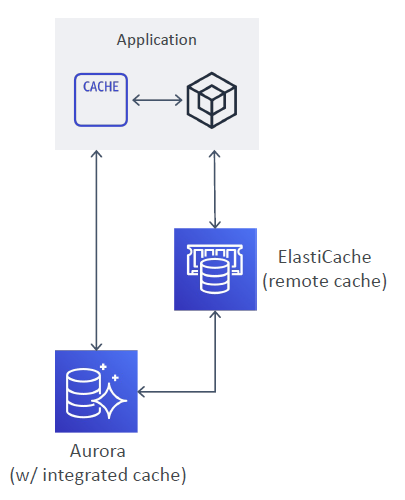
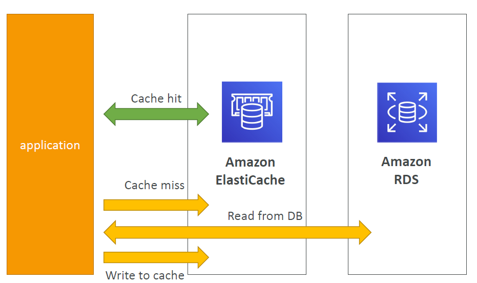
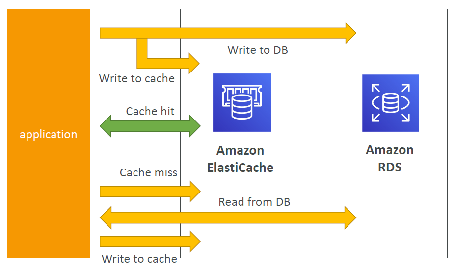
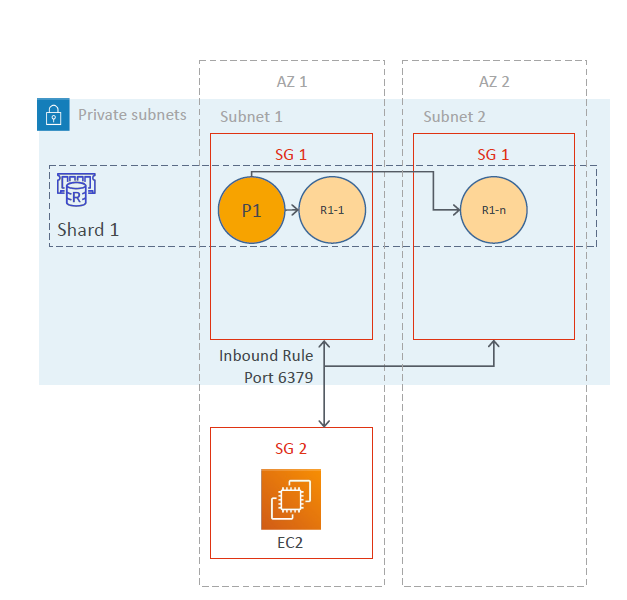

# ElastiCache

---
## Overview

* Fully-managed in-memory data store (caching service, to boost DB read performance)
* It is a remote caching service, or a side cache i.e. separate dedicated caching instance
* Provides rapid access to data across distributed nodes
* Two flavors (both are open-source key-value stores)
  * Amazon ElastiCache for Redis
  * Amazon ElastiCache for Memcached
* Sub-millisecond latency for real-time applications
* Redis supports complex data types, snapshots, replication, encryption, transactions,pub/sub messaging, transactional Lua scripting, and support for geospatial data
* Multithreaded architecture support with Memcached
* Redis suitable for complex applications including message queues, session caching,leaderboards etc.
* Memcached suitable for relatively simple applications like static website caching
* In-memory database offering high performance and low latency
* Can be put in front of databases such as RDS and DynamoDB
* ElastiCache nodes run on Amazon EC2 instances, so you must choose an instance family/type Instance
### Database caches

* Store frequently accessed data (read operations)
* Improve DB performance by taking the most read load off the DB
* Three types – integrated / local / remote caches
  1. Database integrated cache (stores data within DB)
     * Typically limited by available memory and resources
     * Example – Integrated cache in Aurora
     * integrated and managed cache with built-in write-through capabilities
     * enabled by default and no code changes needed
  2. Local cache (stores data within application)
  3. Remote cache (stores data on dedicated servers)
     * Typically built upon key/value NoSQL stores
     * Example – Redis and Memcached
     * Support up-to a million requests per second per cache node
     * Offer sub-millisecond latency
     * Caching of data and managing its validity is managed by your application
### Caching Strategies
1. Lazy loading – loads data into the cache only when necessary

   * Reactive approach
   * Only the queried data is cached (small size)
   * There is a cache miss penalty
   * Can contain stale data (use appropriate TTL)
2. Write through – loads data into the cache as it gets written to the DB

   * Proactive approach
   * Data is always current (never stale)
   * Results in cache churn (most data is never read, use TTL to save space)
3. Lazy loading with write through
   * Get the benefits of both strategies
   * Always use appropriate TTL

## Redis
### Cluster mode disabled

* Redis clusters are generally placed in private subnets
* Accessed from EC2 instance placed in a public subnet in a VPC
* Cluster mode disabled – single shard
* A shard has a primary node and 0-5 replicas
* A shard with replicas is also called as a replication group
* Replicas can be deployed as Multi-AZ
* Multi-AZ replicas support Auto-Failover capability
* Single reader endpoint (auto updates replica endpoint changes)
#### Scaling
* Vertical Scaling
  * scale up / scale down node type
  * minimal downtime
* Horizontal scaling
  * add / remove replica nodes
  * if Multi-AZ with automatic failover is enabled, you cannot remove the last replica
### Cluster mode enabled

* Cluster mode enabled – multiple shards
* Data is distributed across the available shards
* A shard has a primary node and 0-5 replicas
* Multi-AZ replicas support Auto-Failover capability
* Max 90 nodes per cluster (90 shards w/ no replicas to 15 shards w/ 5 replicas each)
* Minimum 3 shards recommended for HA
* Use nitro system-based node types for higher performance (e.g. M5 / R5 etc)
#### Scaling
* Vertical Scaling (Online)
  * scale up / scale down node type
  * no downtime
* Horizontal scaling (=resharding and shard rebalancing)
  * allows partitioning across shards
  * add / remove / rebalance shards
  * resharding = change the number of shards as needed
  * shard rebalancing = ensure that data is equally distributed across shards
  * two modes – offline (with downtime) and online (no downtime)
### Engine difference

|Cluster Mode Disabled|Cluster Mode Enabled| 
 |-|-|

Cluster Mode Disabled
• 1 shard
• 0-5 replicas
• If 0 replicas, primary failure = total
data loss
• Multi-AZ supported
• Supports scaling
• If primary load is read-heavy, you
can scale the cluster (though up to 5
replicas max)
Cluster Mode Enabled
• Up to 90 shards
• 0-5 replicas per shard
• If 0 replicas, primary failure = total
data loss in that shard
• Multi-AZ required
• Supports partitioning
• Good for write-heavy nodes (you
get additional write endpoints, one
per shard)
**Memcached**

* Add nodes to a cluster
* Scale vertically (node type) –must create a new cluster manually
  **Redis**
* **Cluster mode disabled:**
  
* Add replica or change node type –creates a new cluster and migrates data
* **Cluster mode enabled:**
  
* Online reshardingto add or remove shards; vertical scaling to change node type
* Offline reshardingto add or remove shards change node type or upgrade engine (more flexible than online)
### ElastiCache Use Cases
* Data that is relatively staticand frequently accessed
* Applications that are tolerant of stale data
* Data is slow and expensive to get compared to cache retrieval
* Require push-button scalability for memory, writes and reads
* Often used for storing session state