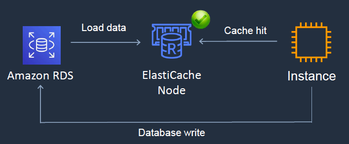
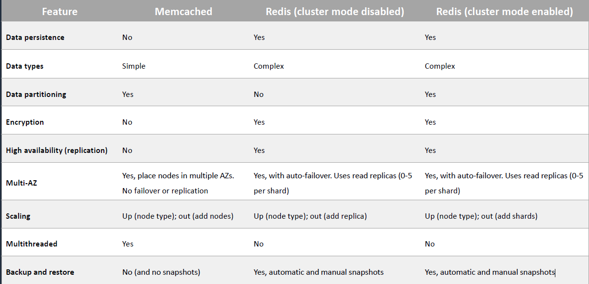
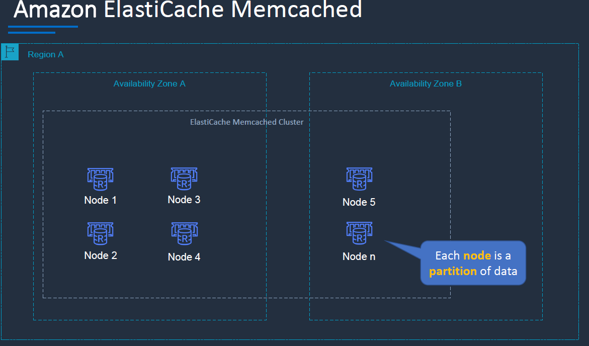
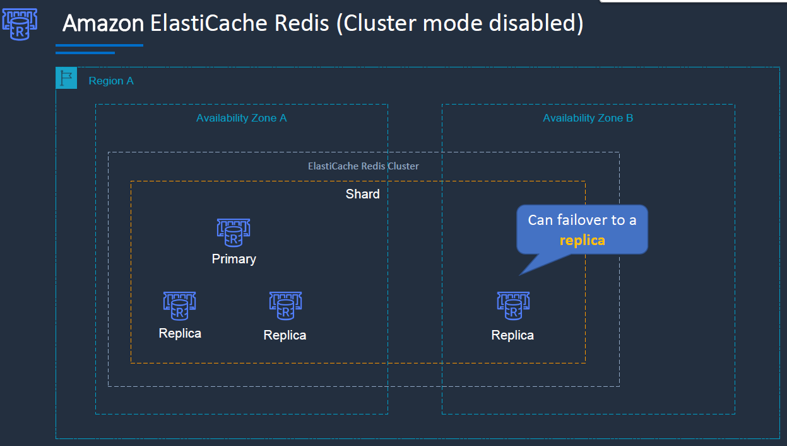
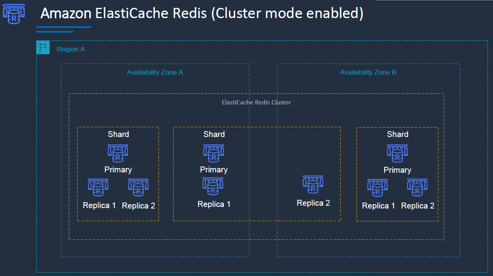

# ElastiCache

---
## AWS ElastiCache

* Fully managed implementations Redisand Memcached
* ElastiCache is a key/value store
* In-memory database offering high performance and low latency
* Can be put in front of databases such as RDS and DynamoDB
* ElastiCache nodes run on Amazon EC2 instances, so you must choose an instance family/type Instance
### Engine difference

**Memcached**

* Add nodes to a cluster
* Scale vertically (node type) –must create a new cluster manually
  **Redis**
* **Cluster mode disabled:**
  
* Add replica or change node type –creates a new cluster and migrates data
* **Cluster mode enabled:**
  
* Online reshardingto add or remove shards; vertical scaling to change node type
* Offline reshardingto add or remove shards change node type or upgrade engine (more flexible than online)
### ElastiCache Use Cases
* Data that is relatively staticand frequently accessed
* Applications that are tolerant of stale data
* Data is slow and expensive to get compared to cache retrieval
* Require push-button scalability for memory, writes and reads
* Often used for storing session state