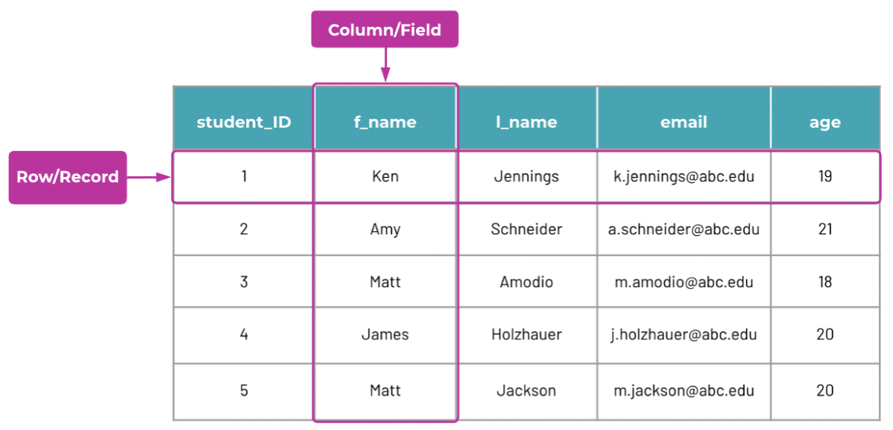
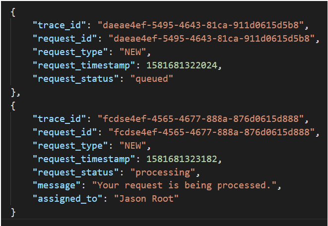
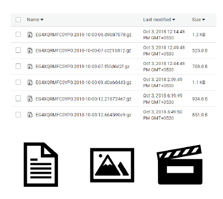

# Database Basics

---
A database is an organized collection of structured information, or data
### Basics of data 
#### DATA
a collection of values or information
* **Structured Data and Schema:**

    * Structured data is organized information that follows a predefined format.
    * A schema defines the structure and organization of data within a database, exemplified by tables in a relational database.
    * Suitable for OLTP (Online transactional process)and OLAP (Online analytical Process) workloads
    * Suited for complex queries and analytics e.g. complex table join operations
    * In Amazon RDS (Relational Database Service), users can define a schema for their databases, specifying tables, columns, and relationships (Amazon RDS - Working with DB Instances).
* **Semi-Structured Data:**
  
    * Semi-structured data is organized but doesn't strictly adhere to a schema, allowing for varied attributes.
    * Well suited for big data and low-latency applications Examples: XML and JSON
    * Typical of non-relational databases
    * AWS DynamoDB: Suited for semi-structured data and scenarios requiring high performance and low latency (Amazon DynamoDB - Data Model).
* **Unstructured Data:**
  
    * Unorganized data,No defined schema Example: documents, photos, videos, music
    * Typical of non-relational databases, file systems, data stores or data lakes like Amazon S3
    * Searching and organizing unstructured data can be more challenging compared to structured or semi-structured data.