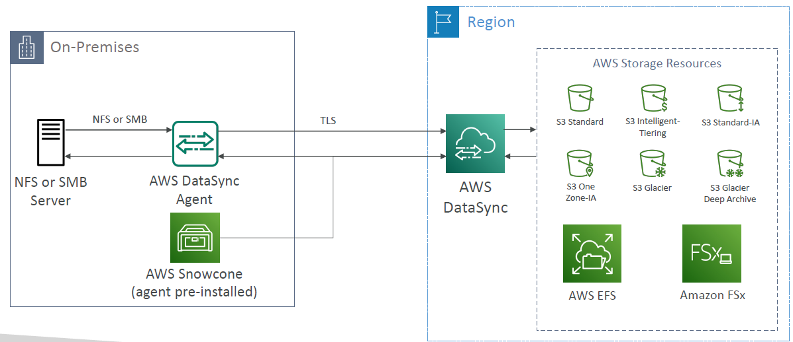
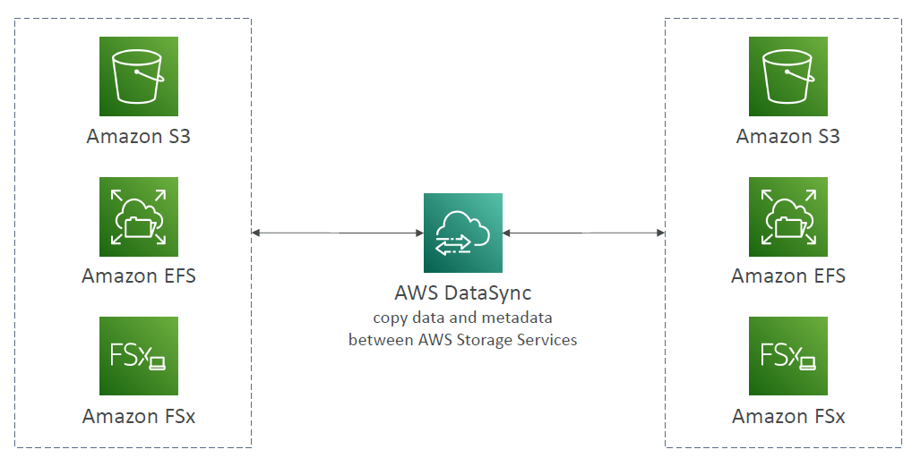

# AWS DataSync

---

* Move large amount of data to and from
  * On-premises / other cloud to AWS (NFS, SMB, HDFS, S3 API…) – needs agent
  * AWS to AWS (different storage services) – no agent needed
* Can synchronize to:
  * Amazon S3 (any storage classes – including Glacier)
  * Amazon EFS
  * Amazon FSx (Windows, Lustre, NetApp, OpenZFS...)
* Replication tasks can be scheduled hourly, daily, weekly
* File permissions and metadata are preserved (NFS POSIX, SMB…)
* One agent task can use 10 Gbps, can setup a bandwidth limit
### AWS storage services

### Storage Comparison
* **S3**: Object Storage
* **S3 Glacier**: Object Archival
* **EBS volumes**: Network storage for one EC2 instance at a time
* **Instance Storage**: Physical storage for your EC2 instance (high IOPS)
* **EFS**: Network File System for Linux instances, POSIX filesystem
* **FSx for Windows**: Network File System for Windows servers
* **FSx for Lustre**: High Performance Computing Linux file system
* **FSx for NetApp ONTAP**: High OS Compatibility
* **FSx for OpenZFS**: Managed ZFS file system
* **Storage Gateway**: S3 & FSx File Gateway, Volume Gateway (cache & stored), Tape Gateway
* **Transfer Family**: FTP, FTPS, SFTP interface on top of Amazon S3 or Amazon EFS
* **DataSync**: Schedule data sync from on-premises to AWS, or AWS to AWS
* **Snowcone / Snowball / Snowmobile**: to move large amount of data to the cloud, physically
* **Database**: for specific workloads, usually with indexing and querying