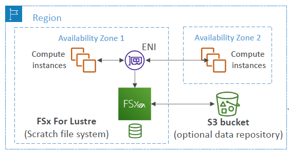
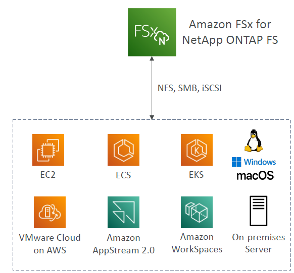
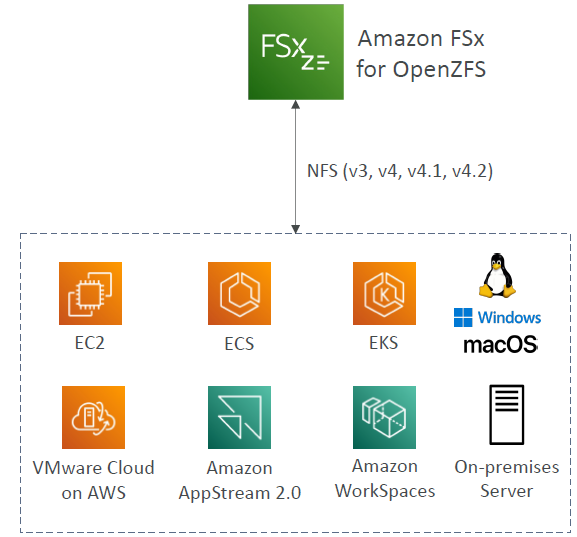

# Amazon FSx

---
### Overview
* Launch 3rd party high-performance file systems on AWS
* Fully managed service
### Amazon FSx for Windows
* FSx for Windows is a fully managed Windows file system share drive
* Supports SMB protocol & Windows NTFS
* Microsoft Active Directory integration, ACLs, user quotas
* Can be mounted on Linux EC2 instances
* Supports Microsoft's Distributed File System (DFS) Namespaces (group files across multiple FS)
* Scale up to 10s of GB/s, millions of IOPS, 100s PB of data
* Storage Options:
  * SSD – latency sensitive workloads (databases, media processing, data analytics, …)
  * HDD – broad spectrum of workloads (home directory, CMS, …)
* Can be accessed from your on-premises infrastructure (VPN or Direct Connect)
* Can be configured to be Multi-AZ (high availability)
* Data is backed-up daily to S3
### Amazon FSx for Lustre
* Lustre is a type of parallel distributed file system, for large-scale computing
* The name Lustre is derived from “Linux” and “cluster
* Machine Learning, High Performance Computing (HPC)
* Video Processing, Financial Modeling, Electronic Design Automation
* Scales up to 100s GB/s, millions of IOPS, sub-ms latencies
* Storage Options:
  * SSD – low-latency, IOPS intensive workloads, small & random file operations
   * HDD – throughput-intensive workloads, large & sequential file operations
* Seamless integration with S3
  * Can “read S3” as a file system (through FSx)
  * Can write the output of the computations back to S3 (through FSx)
* Can be used from on-premises servers (VPN or Direct Connect
#### FSx Lustre - File System Deployment Options
##### Scratch File System

* Temporary storage
* Data is not replicated (doesn’t persist if file server fails)
* High burst (6x faster, 200MBps per TiB)
* Usage: short-term processing, optimize costs
##### Persistent File System

* Long-term storage
* Data is replicated within same AZ
* Replace failed files within minutes
* Usage: long-term processing, sensitive data
### Amazon FSx for NetApp ONTAP

* Managed NetApp ONTAP on AWS
* File System compatible with NFS, SMB, iSCSI
protocol
* Move workloads running on ONTAP or NAS to AWS
* Works with:
  * Linux
  * Windows
  * MacOS
  * VMware Cloud on AWS
  * Amazon Workspaces & AppStream 2.0
  * Amazon EC2, ECS and EKS
* Storage shrinks or grows automatically
* Snapshots, replication, low-cost, compression and data de-duplication
* Point-in-time instantaneous cloning (helpful for testing new workloads)
### Amazon FSx for OpenZFS

* Managed OpenZFS file system on AWS
* File System compatible with NFS (v3, v4, v4.1, v4.2)
* Move workloads running on ZFS to AWS
* Works with:
  * Linux
  * Windows
  * MacOS
  * VMware Cloud on AWS
  * Amazon Workspaces & AppStream 2.0
  * Amazon EC2, ECS and EKS
* Up to 1,000,000 IOPS with < 0.5ms latency
* Snapshots, compression and low-cost
* Point-in-time instantaneous cloning (helpful for testing new workloads)