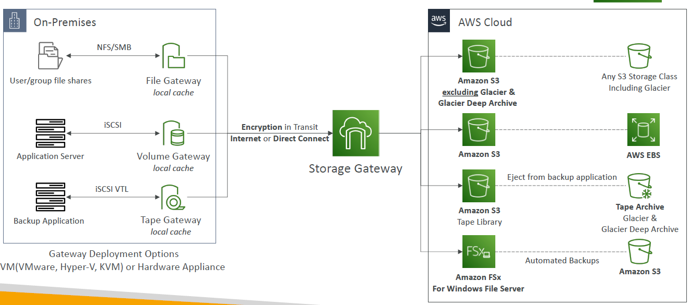
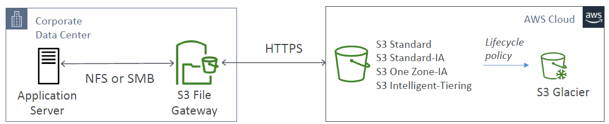
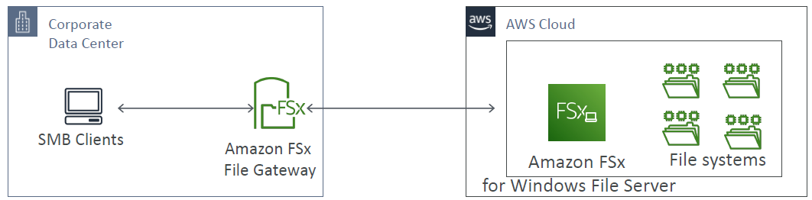
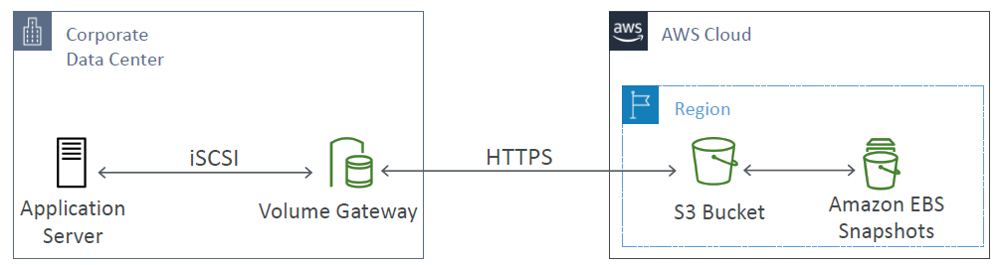
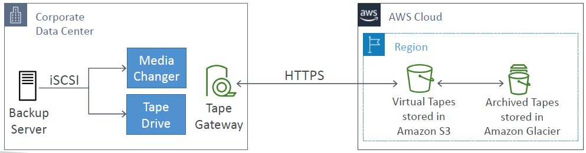

# AWS Gateway

---

* Bridge between on-premises data and cloud data
* Use cases:
  * disaster recovery
  * backup & restore
  * tiered storage
  * on-premises cache & low-latency files access
* **Types of Storage Gateway:**
  * S3 File Gateway
  * FSx File Gateway
  * Volume Gateway
  * Tape Gateway
### Amazon S3 File Gateway

* Configured S3 buckets are accessible using the NFS and SMB protocol
* Most recently used data is cached in the file gateway
* Supports S3 Standard, S3 Standard IA, S3 One Zone A, S3 Intelligent Tiering
* Transition to S3 Glacier using a Lifecycle Policy
* Bucket access using IAM roles for each File Gateway
* SMB Protocol has integration with Active Directory (AD) for user authentication
### Amazon FSx File Gateway

* Native access to Amazon FSx for Windows File Server
* Local cache for frequently accessed data
* Windows native compatibility (SMB, NTFS, Active Directory...)
* Useful for group file shares and home directories
### Volume Gateway

* Block storage using iSCSI protocol backed by S3
* Backed by EBS snapshots which can help restore on-premises volumes!
* Cached volumes: low latency access to most recent data
* Stored volumes: entire dataset is on premise, scheduled backups to S3
### Tape Gateway

* Some companies have backup processes using physical tapes (!)
* With Tape Gateway, companies use the same processes but, in the cloud
* Virtual Tape Library (VTL) backed by Amazon S3 and Glacier
* Back up data using existing tape-based processes (and iSCSI interface)
* Works with leading backup software vendors