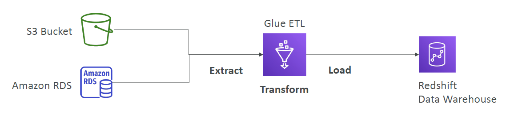
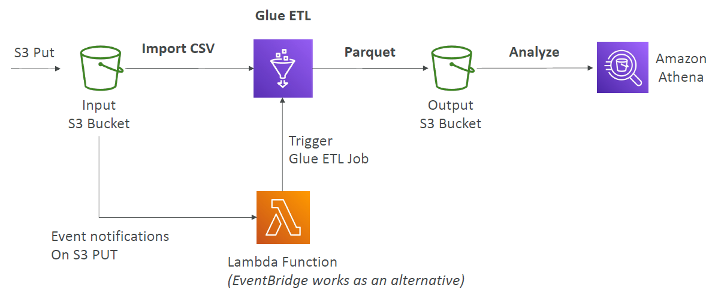
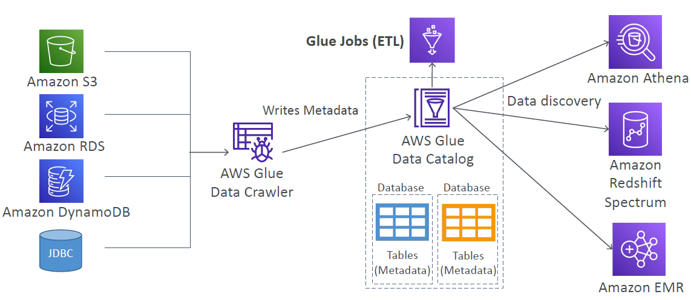

# AWS Glue

---

* Managed extract, transform, and load (ETL) service
* Useful to prepare and transform data for analytics
* Fully serverless service
### Convert data into Parquet format

### Glue Data Catalog
