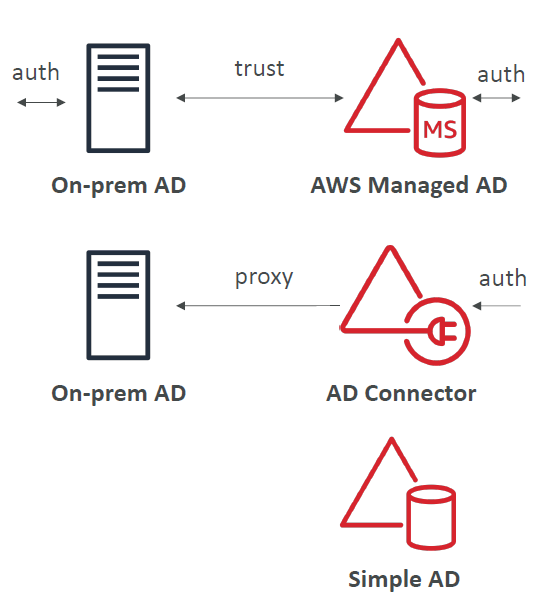
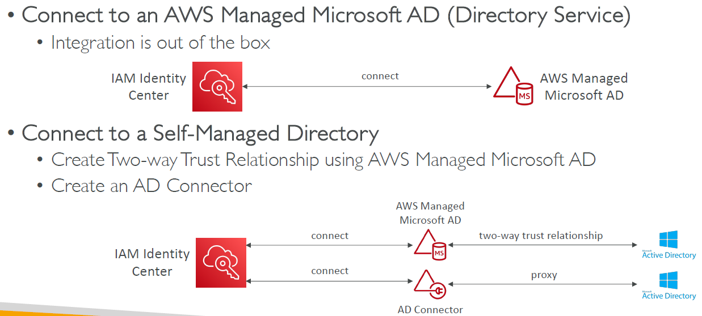

# AWS IAM Identity Center

---

* One login (single sign-on) for all your
  * AWS accounts in AWS Organizations
  * Business cloud applications (e.g., Salesforce, Box, Microsoft 365, …)
  * SAML2.0-enabled applications
  * EC2 Windows Instances
* Identity providers
  * Built-in identity store in IAM Identity Center
  * 3rd party: Active Directory (AD), OneLogin, Okta…
### AWS IAM Identity Center Fine-grained Permissions and Assignments

* Multi-Account Permissions
  * Manage access across AWS accounts in your AWS Organization
  * Permission Sets – a collection of one or more IAM Policies assigned to users and groups to define AWS access
* Application Assignments
  * SSO access to many SAML 2.0 business applications (Salesforce, Box, Microsoft 365, …)
  * Provide required URLs, certificates, and metadata
* Attribute-Based Access Control (ABAC)
  * Fine-grained permissions based on users’ attributes stored in IAM Identity Center Identity Store
  * Example: cost center, title, locale, …
  * Use case: Define permissions once, then modify AWS access by changing the attributes
### What is Microsoft Active Directory (AD)?
* Found on any Windows Server with AD Domain Services
* Database of objects: User Accounts, Computers, Printers, File Shares, Security Groups
* Centralized security management, create account, assign permissions
* Objects are organized in trees
* A group of trees is a forest
### AWS Directory Services

* AWS Managed Microsoft AD
  * Create your own AD in AWS, manage users locally, supports MFA
  * Establish “trust” connections with your onpremises AD
* AD Connector
  * Directory Gateway (proxy) to redirect to onpremises AD, supports MFA
  * Users are managed on the on-premises AD
* Simple AD
  * AD-compatible managed directory on AWS
  * Cannot be joined with on-premises AD
### IAM Identity Center – Active Directory Setup

## AWS Control Tower
* Easy way to set up and govern a secure and compliant multi-account
AWS environment based on best practices
* AWS Control Tower uses AWS Organizations to create accounts
* Benefits:
  * Automate the set up of your environment in a few clicks
  * Automate ongoing policy management using guardrails
  * Detect policy violations and remediate them
  * Monitor compliance through an interactive dashboard
### AWS Control Tower – Guardrails
* Provides ongoing governance for your Control Tower environment (AWS Accounts)
* Preventive Guardrail – using SCPs (e.g., Restrict Regions across all your accounts)
* Detective Guardrail – using AWS Config (e.g., identify untagged resources)