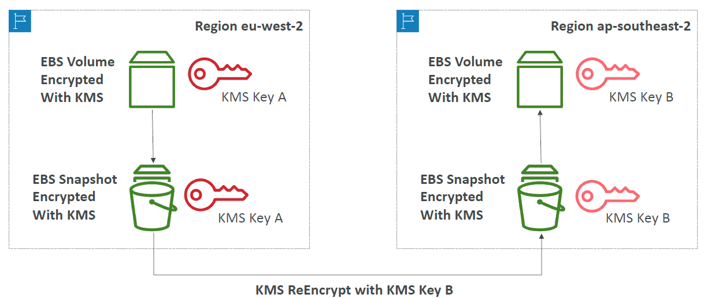
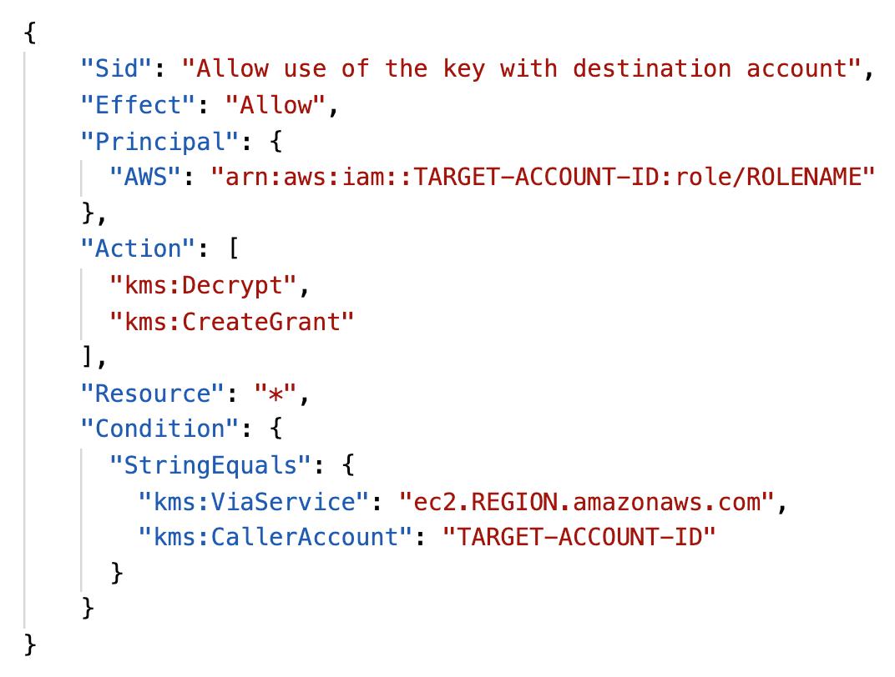
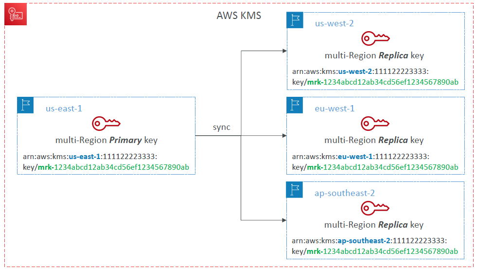
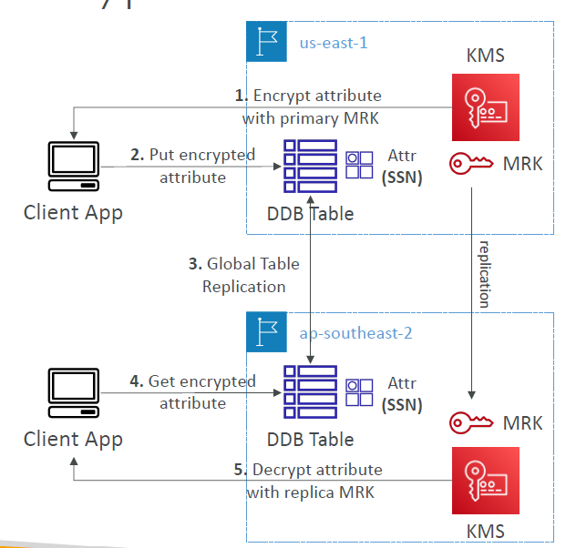

# AWS KMS

---
* Anytime you hear “encryption” for an AWS service, it’s most likely KMS
* AWS manages encryption keys for us
* Fully integrated with IAM for authorization
* Easy way to control access to your data
* Able to audit KMS Key usage using CloudTrail
* Seamlessly integrated into most AWS services (EBS, S3, RDS, SSM…)
* Never ever store your secrets in plaintext, especially in your code!
  * KMS Key Encryption also available through API calls (SDK, CLI)
  * Encrypted secrets can be stored in the code / environment variables
### KMS Keys Types
* KMS Keys is the new name of KMS Customer Master Key
* **Symmetric (AES-256 keys)**
  * Single encryption key that is used to Encrypt and Decrypt
  * AWS services that are integrated with KMS use Symmetric CMKs
  * You never get access to the KMS Key unencrypted (must call KMS API to use)
* **Asymmetric (RSA & ECC key pairs)**
  * Public (Encrypt) and Private Key (Decrypt) pair
  * Used for Encrypt/Decrypt, or Sign/Verify operations
  * The public key is downloadable, but you can’t access the Private Key unencrypted
  * Use case: encryption outside of AWS by users who can’t call the KMS API
### AWS KMS (Key Management Service)
* Types of KMS Keys:
  * AWS Owned Keys (free): SSE-S3, SSE-SQS, SSE-DDB (default key)
  * AWS Managed Key: free (aws/service-name, example: aws/rds or aws/ebs)
  * Customer managed keys created in KMS: $1 / month
  * Customer managed keys imported (must be symmetric key): $1 / month
  * + pay for API call to KMS ($0.03 / 10000 calls)
* Automatic Key rotation:
  * AWS-managed KMS Key: automatic every 1 year
  * Customer-managed KMS Key: (must be enabled) automatic every 1 year
  * Imported KMS Key: only manual rotation possible using alias
### Copying Snapshots across regions

### KMS Key Policies
* Control access to KMS keys, “similar” to S3 bucket policies
* Difference: you cannot control access without them
* Default KMS Key Policy:
  * Created if you don’t provide a specific KMS Key Policy
  * Complete access to the key to the root user = entire AWS account
* Custom KMS Key Policy:
  * Define users, roles that can access the KMS key
  * Define who can administer the key
  * Useful for cross-account access of your KMS key
### Copying Snapshots across accounts

1. Create a Snapshot, encrypted with your own KMS Key (Customer Managed Key)
2. Attach a KMS Key Policy to authorize cross-account access
3. Share the encrypted snapshot
4. (in target) Create a copy of the Snapshot, encrypt it with a CMK in your account
5. Create a volume from the snapshot
### KMS Multi-Region Keys

* Identical KMS keys in different AWS Regions that can be used interchangeably
* Multi-Region keys have the same key ID, key material, automatic rotation…
* Encrypt in one Region and decrypt in other Regions
* No need to re-encrypt or making cross-Region API calls
* KMS Multi-Region are NOT global (Primary + Replicas)
* Each Multi-Region key is managed independently
* Use cases: global client-side encryption, encryption on Global DynamoDB, Global Aurora
### DynamoDB Global Tables and KMS Multi-Region Keys Client-Side encryption

* We can encrypt specific attributes client-side in our DynamoDB table using the Amazon DynamoDB Encryption Client
* Combined with Global Tables, the client-side encrypted data is replicated to other regions
* If we use a multi-region key, replicated in the same region as the DynamoDB Global table, then clients in these regions can use lowlatency API calls to KMS in their region to decrypt the data client-side
* Using client-side encryption we can protect specific fields and guarantee only decryption if the client has access to an API key