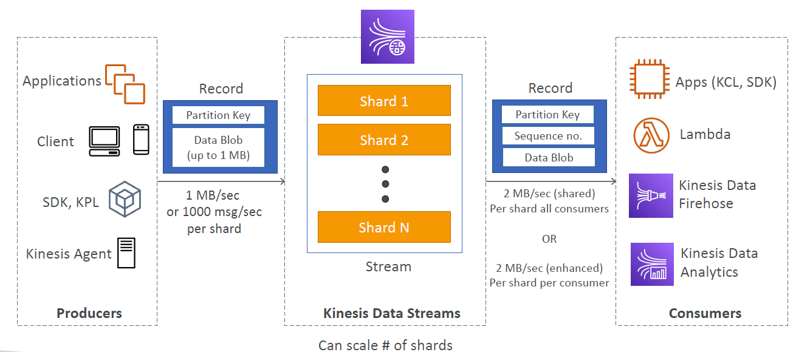
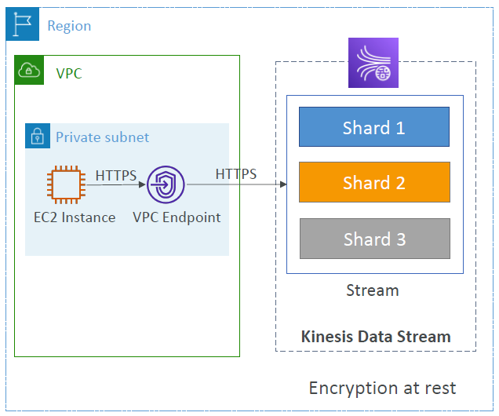
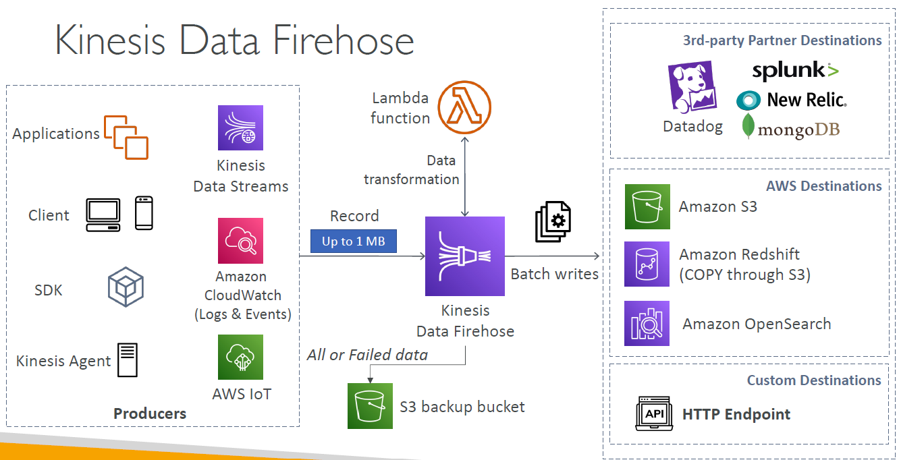
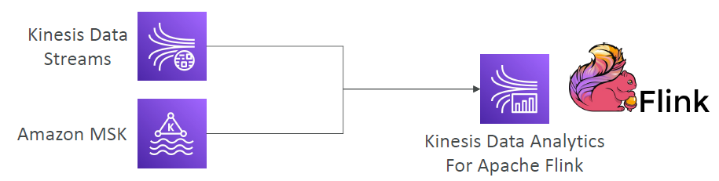

# AWS Kinesis

---
### Overview

* Makes it easy to collect, process, and analyze streaming data in real-time
* Ingest real-time data such as: Application logs, Metrics, Website clickstreams, IoT telemetry data…
* Kinesis Data Streams: capture, process, and store data streams
* Kinesis Data Firehose: load data streams into AWS data stores
* Kinesis Data Analytics: analyze data streams with SQL or Apache Flink
* Kinesis Video Streams: capture, process, and store video streams
## Kinesis Data Streams
* Retention between 1 day to 365 days
* Ability to reprocess (replay) data
* Once data is inserted in Kinesis, it can’t be deleted (immutability)
* Data that shares the same partition goes to the same shard (ordering)
* Producers: AWS SDK, Kinesis Producer Library (KPL), Kinesis Agent
* Consumers:
  * Write your own: Kinesis Client Library (KCL), AWS SDK
  * Managed: AWS Lambda, Kinesis Data Firehose, Kinesis Data Analytics
### Capacity Modes
* Provisioned mode:
  * You choose the number of shards provisioned, scale manually or using API
  * Each shard gets 1MB/s in (or 1000 records per second)
  * Each shard gets 2MB/s out (classic or enhanced fan-out consumer)
  * You pay per shard provisioned per hour
* On-demand mode:
  * No need to provision or manage the capacity
  * Default capacity provisioned (4 MB/s in or 4000 records per second)
  * Scales automatically based on observed throughput peak during the last 30 days
  * Pay per stream per hour & data in/out per GB
### Kinesis Data Streams Security

* Control access / authorization using IAM policies
* Encryption in flight using HTTPS endpoints
* Encryption at rest using KMS
* You can implement encryption/decryption of data on client side (harder)
* VPC Endpoints available for Kinesis to access within VPC
* Monitor API calls using CloudTrail
## Kinesis Data Firehose

* Fully Managed Service, no administration, automatic scaling, serverless
  * AWS: Redshift / Amazon S3 / OpenSearch
  * 3rd party partner: Splunk / MongoDB / DataDog / NewRelic / …
  * Custom: send to any HTTP endpoint
* Pay for data going through Firehose
* Near Real Time
  * Buffer interval: 0 seconds (no buffering) to 900 seconds
  * Buffer size: minimum 1MB
* Supports many data formats, conversions, transformations, compression
* Supports custom data transformations using AWS Lambda
* Can send failed or all data to a backup S3 bucket
## Kinesis Data Analytics (SQL application)
* Real-time analytics on Kinesis Data Streams & Firehose using SQL
* Add reference data from Amazon S3 to enrich streaming data
* Fully managed, no servers to provision
* Automatic scaling
* Pay for actual consumption rate
* Output:
  * Kinesis Data Streams: create streams out of the real-time analytics queries
  * Kinesis Data Firehose: send analytics query results to destinations
* Use cases:
  * Time-series analytics
  * Real-time dashboards
  * Real-time metrics
### Kinesis Data Analytics for Apache Flink

* Use Flink (Java, Scala or SQL) to process and analyze streaming data
* Run any Apache Flink application on a managed cluster on AWS
  * provisioning compute resources, parallel computation, automatic scaling
  * application backups (implemented as checkpoints and snapshots)
  * Use any Apache Flink programming features
  * Flink does not read from Firehose (use Kinesis Analytics for SQL instead)