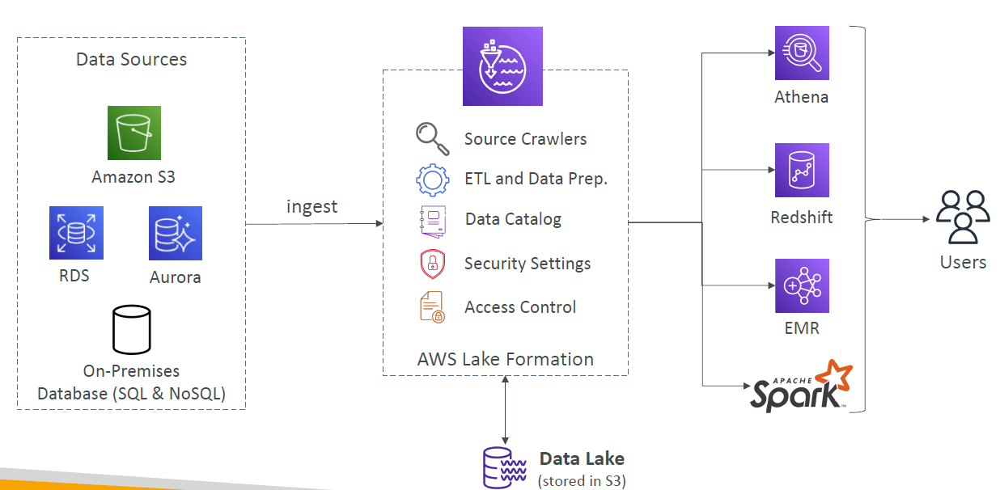
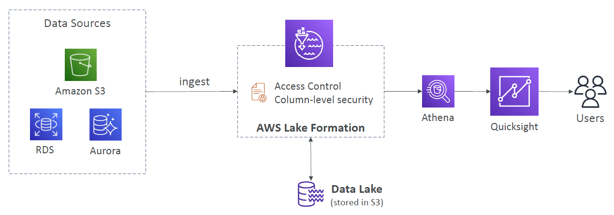

# AWS LakeFormation

---

* Data lake = central place to have all your data for analytics purposes
* Fully managed service that makes it easy to setup a data lake in days
* Discover, cleanse, transform, and ingest data into your Data Lake
* It automates many complex manual steps (collecting, cleansing, moving, cataloging data, …) and de-duplicate (using ML Transforms)
* Combine structured and unstructured data in the data lake
* Out-of-the-box source blueprints: S3, RDS, Relational & NoSQL DB…
* Fine-grained Access Control for your applications (row and column-level)
* Built on top of AWS Glue
### AWS Lake Formation Centralized Permissions Example

