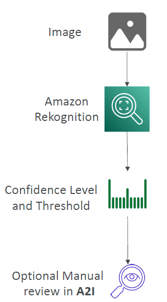
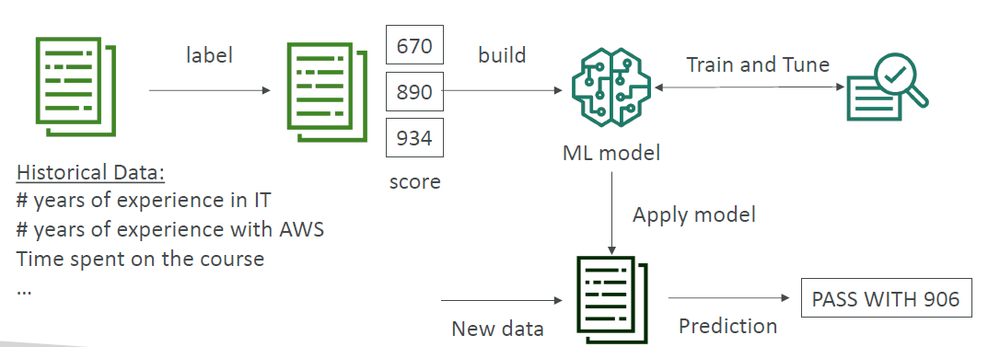
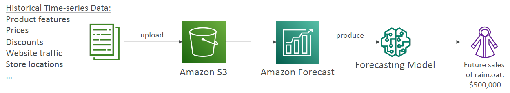

# AWS Machin Learning

---
## Amazon Rekognition
* Find objects, people, text, scenes in images and videos using ML
* Facial analysis and facial search to do user verification, people counting
* Create a database of “familiar faces” or compare against celebrities
* Use cases:
  * Labeling
  * Content Moderation
  * Text Detection
  * Face Detection and Analysis (gender, age range, emotions…)
  * Face Search and Verification
  * Celebrity Recognition
  * Pathing (ex: for sports game analysis)
### Content Moderation

* Detect content that is inappropriate, unwanted, or offensive (image and videos)
* Used in social media, broadcast media, advertising, and e-commerce situations to create a safer user experience
* Set a Minimum Confidence Threshold for items that will be flagged
* Flag sensitive content for manual review in Amazon Augmented AI (A2I)
* Help comply with regulations
## Amazon Transcribe
* Automatically convert speech to text
* Uses a deep learning process called automatic speech recognition (ASR) to convert speech to text quickly and accurately
* Automatically remove Personally Identifiable Information (PII) using Redaction
* Supports Automatic Language Identification for multi-lingual audio
* Use cases:
  * transcribe customer service calls
  * automate closed captioning and subtitling
  * generate metadata for media assets to create a fully searchable archive
## Amazon Polly
* Turn text into lifelike speech using deep learning
* Allowing you to create applications that talk
## Amazon Translate
* Natural and accurate language translation
* Amazon Translate allows you to localize content - such as websites and applications - for international users, and to easily translate large volumes of text efficiently.
## Amazon Comprehend
* For Natural Language Processing – NLP
* Fully managed and serverless service
* Uses machine learning to find insights and relationships in text
  * Language of the text
  * Extracts key phrases, places, people, brands, or events
  * Understands how positive or negative the text is
  * Analyzes text using tokenization and parts of speech
  * Automatically organizes a collection of text files by topic
* Sample use cases:
  * analyze customer interactions (emails) to find what leads to a positive or negative experience
  * Create and groups articles by topics that Comprehend will uncover
## Amazon SageMaker

* Fully managed service for developers / data scientists to build ML models
* Typically, difficult to do all the processes in one place + provision servers
* Machine learning process (simplified): predicting your exam score
## Amazon Forecast

* Fully managed service that uses ML to deliver highly accurate forecasts
* Example: predict the future sales of a raincoat
* 50% more accurate than looking at the data itself
* Reduce forecasting time from months to hours
* Use cases: Product Demand Planning, Financial Planning, Resource Planning, …
## Amazon Kendra
* Fully managed document search service powered by Machine Learning
* Extract answers from within a document (text, pdf, HTML, PowerPoint, MS Word, FAQs…)
* Natural language search capabilities
* Learn from user interactions/feedback to promote preferred results (Incremental Learning)
* Ability to manually fine-tune search results (importance of data, freshness, custom, …)