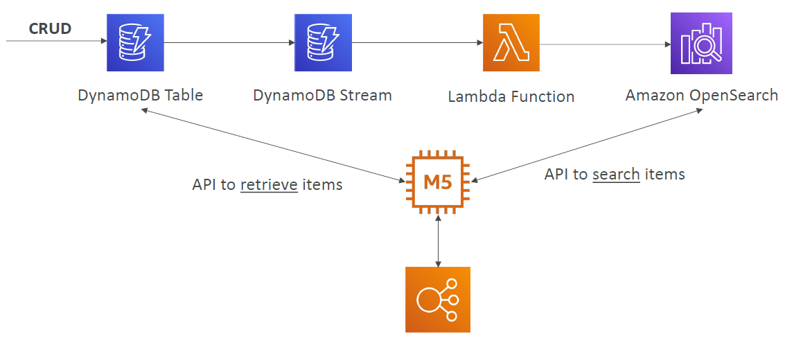
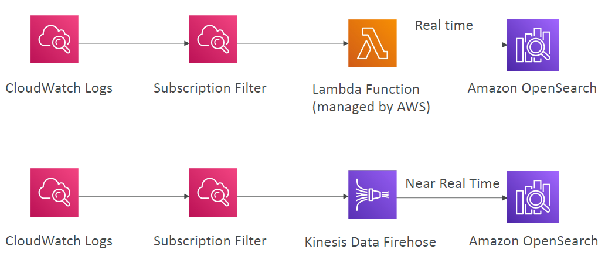
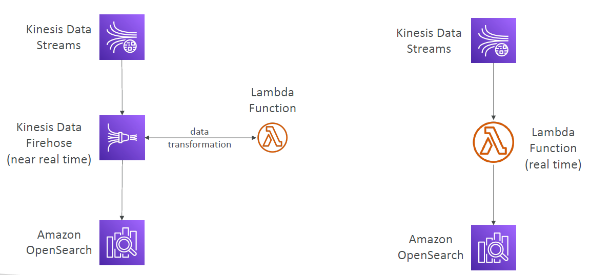

# AWS OpenSearch

---
* Amazon OpenSearch is successor to Amazon ElasticSearch
* In DynamoDB, queries only exist by primary key or indexes…
* With OpenSearch, you can search any field, even partially matches
* It’s common to use OpenSearch as a complement to another database
* Two modes: managed cluster or serverless cluster
* Does not natively support SQL (can be enabled via a plugin)
* Ingestion from Kinesis Data Firehose, AWS IoT, and CloudWatch Logs
* Security through Cognito & IAM, KMS encryption, TLS
* Comes with OpenSearch Dashboards (visualization)
### OpenSearch patterns DynamoDB

### OpenSearch patterns CloudWatch Logs

### OpenSearch patterns Kinesis Data Streams & Kinesis Data Firehose
