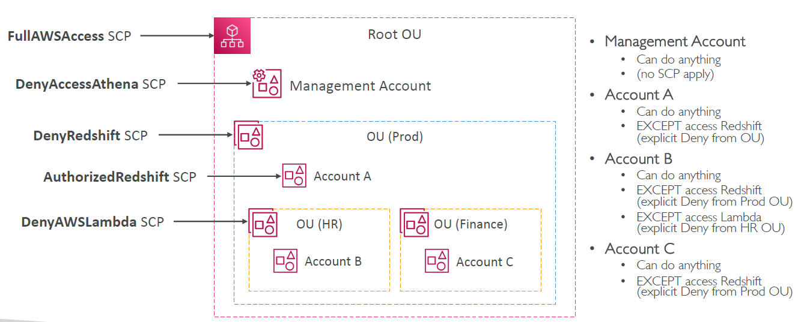

# AWS Organizations

---

* Global service
* Allows to manage multiple AWS accounts
* The main account is the management account
* Other accounts are member accounts
* Member accounts can only be part of one organization
* Consolidated Billing across all accounts - single payment method
* Pricing benefits from aggregated usage (volume discount for EC2, S3…)
* Shared reserved instances and Savings Plans discounts across accounts
* API is available to automate AWS account creation
### Advantages
* Multi Account vs One Account Multi VPC
* Use tagging standards for billing purposes
* Enable CloudTrail on all accounts, send logs to central S3 account
* Send CloudWatch Logs to central logging account
* Establish Cross Account Roles for Admin purposes
### Security: Service Control Policies (SCP)
* IAM policies applied to OU or Accounts to restrict Users and Roles
* They do not apply to the management account (full admin power)
* Must have an explicit allow (does not allow anything by default – like IAM)
### SCP Hierarchy
