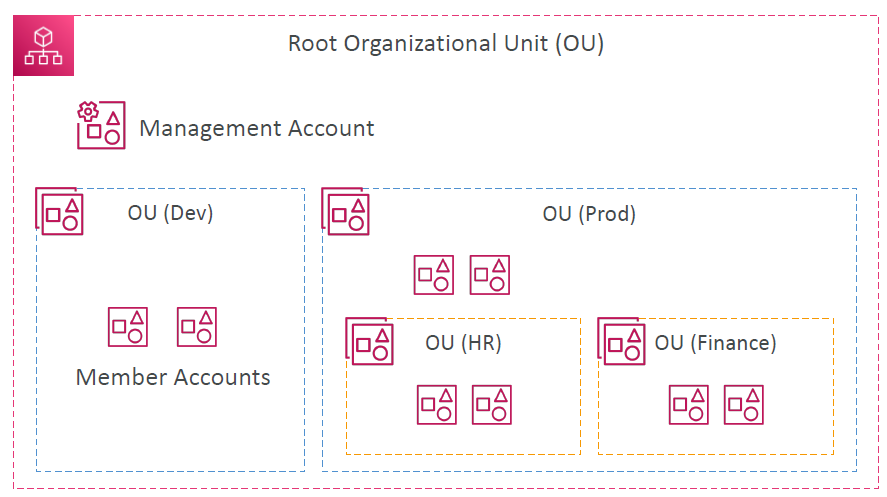

# AWS Organizations

---

* Global service
* Allows to manage multiple AWS accounts
* The main account is the management account
* Other accounts are member accounts
* Member accounts can only be part of one organization
* Consolidated Billing across all accounts - single payment method
* Pricing benefits from aggregated usage (volume discount for EC2, S3…)
* Shared reserved instances and Savings Plans discounts across accounts
* API is available to automate AWS account creation