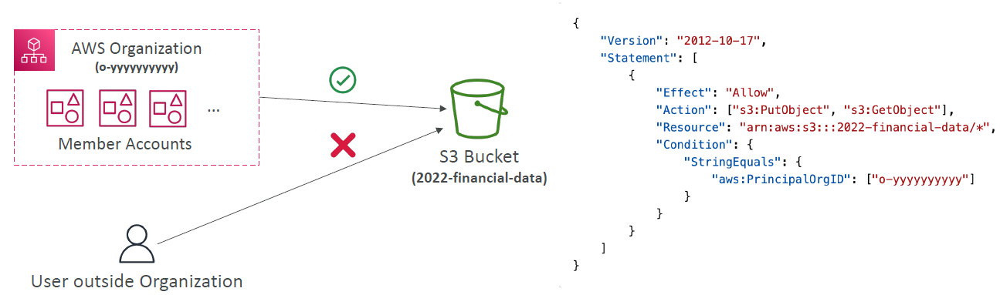
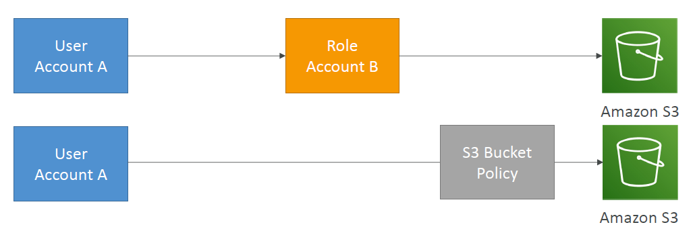
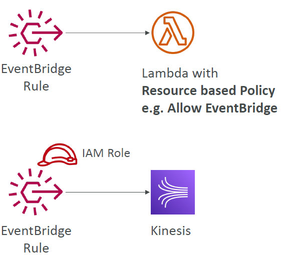
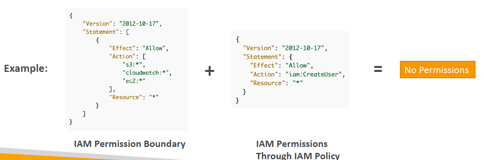
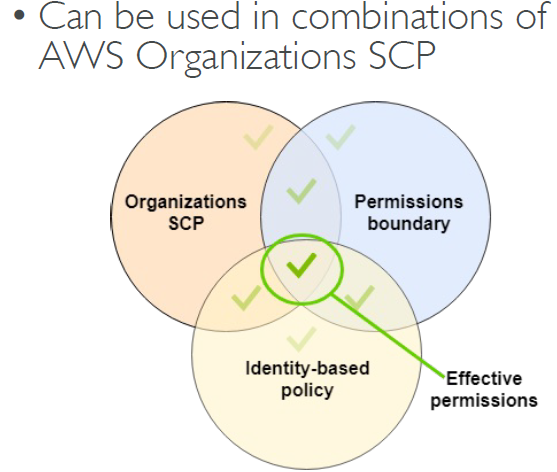

# AWS Organizations

---

* Global service
* Allows to manage multiple AWS accounts
* The main account is the management account
* Other accounts are member accounts
* Member accounts can only be part of one organization
* Consolidated Billing across all accounts - single payment method
* Pricing benefits from aggregated usage (volume discount for EC2, S3…)
* Shared reserved instances and Savings Plans discounts across accounts
* API is available to automate AWS account creation
### Advantages
* Multi Account vs One Account Multi VPC
* Use tagging standards for billing purposes
* Enable CloudTrail on all accounts, send logs to central S3 account
* Send CloudWatch Logs to central logging account
* Establish Cross Account Roles for Admin purposes
### Security: Service Control Policies (SCP)
* IAM policies applied to OU or Accounts to restrict Users and Roles
* They do not apply to the management account (full admin power)
* Must have an explicit allow (does not allow anything by default – like IAM)
### SCP Hierarchy

### Resource Policies & aws:PrincipalOrgID

* aws:PrincipalOrgID can be used in any resource policies to restrict access to accounts that are member of an AWS Organization
### IAM Roles vs Resource Based Policies

* Cross account:
  * attaching a resource-based policy to a resource (example: S3 bucket policy)
  * OR using a role as a proxy
  * When you assume a role (user, application or service), you give up your
    original permissions and take the permissions assigned to the role
  * When using a resource-based policy, the principal doesn’t have to give up his
  permissions
  * Example: User in account A needs to scan a DynamoDB table in Account A
  and dump it in an S3 bucket in Account B.
  * Supported by: Amazon S3 buckets, SNS topics, SQS queues, etc…
### Amazon EventBridge – Security

* When a rule runs, it needs permissions on the target
* Resource-based policy: Lambda, SNS, SQS, CloudWatch Logs, API Gateway…
* IAM role: Kinesis stream, Systems Manager Run Command, ECS task…
### IAM Permission Boundaries

* IAM Permission Boundaries are supported for users and roles (not groups)
* Advanced feature to use a managed policy to set the maximum permissions an IAM entity can get.
#### Use cases

* Delegate responsibilities to non administrators within their permission boundaries, for example create new IAM users
* Allow developers to self-assign policies and manage their own permissions, while making sure they can’t “escalate” their privileges (= make themselves admin)
* Useful to restrict one specific user(instead of a whole account using Organizations & SCP)