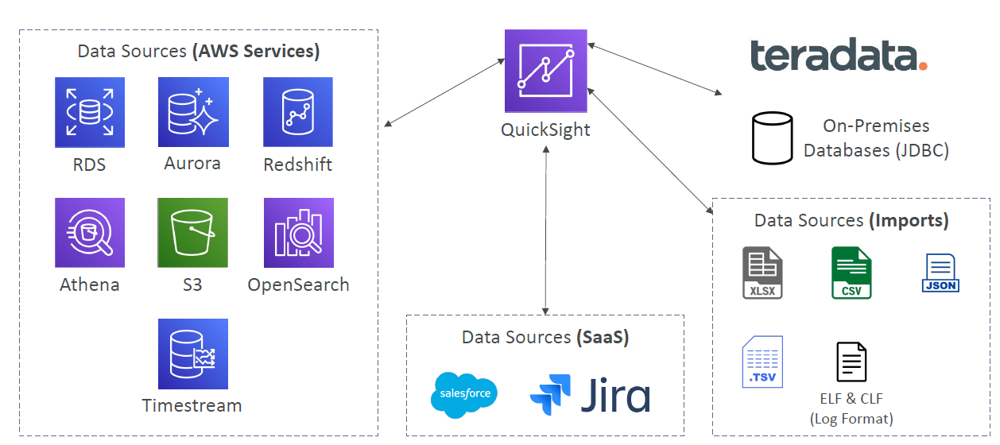

# Amazon QuickSight

* Serverless machine learning-powered business intelligence service to create interactive dashboards
* Fast, automatically scalable, embeddable, with per-session pricing
* Use cases:
* Business analytics
* Building visualizations
* Perform ad-hoc analysis
* Get business insights using data
* Integrated with RDS, Aurora, Athena, Redshift, S3…
* In-memory computation using SPICE engine if data is imported into QuickSight
* Enterprise edition: Possibility to setup Column-Level security (CLS)
### Dashboard & Analysis
* Define Users (standard versions) and Groups (enterprise version)
  * These users & groups only exist within QuickSight, not IAM !!
* A dashboard…
  * is a read-only snapshot of an analysis that you can share
  * preserves the configuration of the analysis (filtering, parameters, controls, sort)
* You can share the analysis or the dashboard with Users or Groups
* To share a dashboard, you must first publish it
* Users who see the dashboard can also see the underlying data