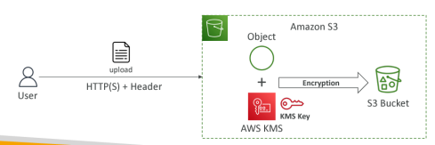

# AWS S3

---
### Overview
* Simple storage service 
* It’s advertised as ”infinitely scaling” storage
* Amazon S3 allows people to store objects (files) in “buckets” (directories)
* Buckets must have a globally unique name (across all regions all accounts)
* Buckets are defined at the region level
* S3 looks like a global service but buckets are created in a region
### Uses
* Backup and storage
* Disaster Recovery
* Archive
* Hybrid Cloud storage
* Application hosting
* Media hosting
* Data lakes & big data analytics
* Software delivery
* Static website
### Naming convention
* No uppercase, No underscore
* 3-63 characters long
* Not an IP
* Must start with lowercase letter or number
* Must NOT start with the prefix xn-
* Must NOT end with the suffix -s3alias
### Object
* Objects (files) have a Key
* The key is the FULL path: s3://my-bucket/my_file.txt
* s3://my-bucket/my_folder1/another_folder/my_file.txt
* The key is composed of prefix + object name
  Ex : s3://my-bucket/my_folder1/another_folder/my_file.txt
* Max. Object Size is 5TB (5000GB)
* If uploading more than 5GB, must use “multi-part upload”
* Version ID (if versioning is enabled)
### Security
1. User based
   * IAM Policies –which API calls should be allowed for a specific user from IAM
2. Resource based
   * Bucket Policies –bucket wide rules from the S3 console -allows cross account
   * Object Access Control List (ACL) –finer grain (can be disabled)
   * Bucket Access Control List (ACL) –less common (can be disabled)
* The user IAM permissions ALLOW it OR the resource policy ALLOWS it AND there’s no explicit DENY
* Encryption :encrypt objects in Amazon S3 using encryption keys
>[!Note]
> 
> Static website hosting
> 
>S3 can host static websites and have them accessible on the Internet
>Ex:  http://demo-bucket.s3-website-us-west-2.amazonaws.com
### Versioning
* You can version your files in Amazon S3
* It is enabled at the bucket level
* Same key overwrite will change the “version”: 1, 2, 3….
* Easy roll back to previous version
* Any file that is not versioned prior to enabling versioning will have version “null”
* Suspending versioning does not delete the previous versions
### Replication
* CRR-> Cross Region Replication
* SRR->Same region Replication
* Must enable Versioning in source and destination buckets
* CRR –compliance, lower latency access, replication across accounts
* SRR –log aggregation, live replication between production and test accounts
### Storage classes
1. Standard -General Purpose
   * 99.99% Availability
   * Used for frequently accessed data
   * Low latency and high throughput
   * Sustain 2 concurrent facility failures
2. Infrequent Access (IA)
   * For data that is less frequently accessed, but requires rapid access when needed
   * Lower cost than S3 Standard
   * Standard-Infrequent Access (S3 Standard-IA)
   * 99.9% Availability
   * Use cases: Disaster Recovery, backups
3. One Zone-Infrequent Access
   * High durability (99.999999999%) in a single AZ; data lost when AZ is destroyed
   * 99.5% Availability
   * Use Cases: Storing secondary backup copies of on-premises data, or data you can recreate
4. Glacier Instant Retrieval
   * Millisecond retrieval, great for data accessed once a quarter
   * Minimum storage duration of 90 days
5. Glacier Flexible Retrieval
   * Expedited (1 to 5 minutes), Standard (3 to 5 hours), Bulk (5 to 12 hours) –free
   * Minimum storage duration of 90 days
6. Glacier Deep Archive
   * Standard (12 hours), Bulk (48 hours)
   * Minimum storage duration of 180 days
### S3 Encryption
* Encrypting data at rest

1. Sever side encryption(SSE-S3)

   * Amazon S3-Managed Keys (SSE-S3) –Enabled by Default
   * Encrypts S3 objects using keys handled, managed, and owned by AWS
   * Object is encrypted server-side
   * Encryption type is AES-256
   * Must set header "x-amz-server-side-encryption": "AES256"
   * Enabled by default for new buckets & new objects
2. Server-Side Encryption with KMS Keys(SSE-KMS)
 
   * Leverage AWS Key Management Service (AWS KMS) to manage encryption keys
   * KMS Keys stored in AWS KMS (SSE-KMS)
   * Encryption using keys handled and managed by AWS KMS (Key Management Service)
   * KMS advantages: user control + audit key usage using CloudTrail
   * Object is encrypted server side
   * Must set header "x-amz-server-side-encryption": "aws:kms"
   #### Limitations
   * If you use SSE-KMS, you may be impacted by the KMS limits
   * When you upload, it calls the GenerateDataKeyKMS API
   * When you download, it calls the Decrypt KMS API
   * Count towards the KMS quota per second (5500, 10000, 30000 req/s based on region)
   * You can request a quota increase using the Service Quotas Console
3. Server side encryption with customer provided key(SSE-C)

   * When you want to manage your own encryption keys
   * Server-Side Encryption using keys fully managed by the customer outside of AWS
   * Amazon S3 does NOT store the encryption key you provide
   * HTTPS must be used
   * Encryption key must provided in HTTP headers, for every HTTP request made
4. Client side encryption
 
   * Use client libraries such as Amazon S3 Client-Side Encryption Library
   * Clients must encrypt data themselves before sending to Amazon S3
   * Clients must decrypt data themselves when retrieving from Amazon S3
   * Customer fully manages the keys and encryption cycle