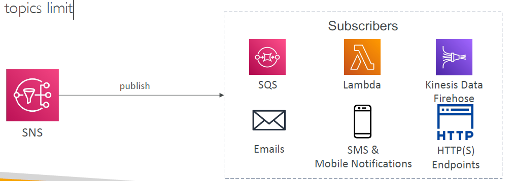
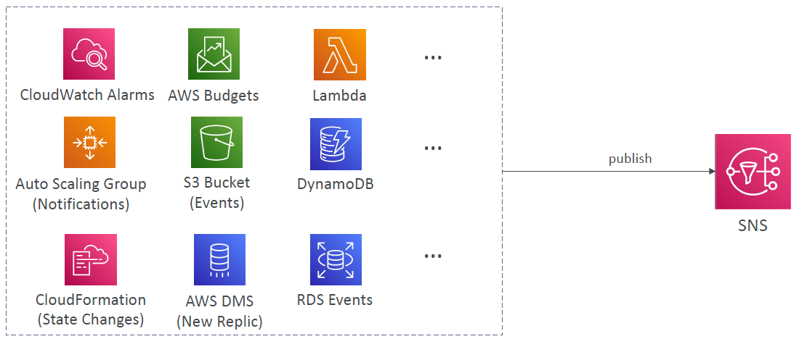
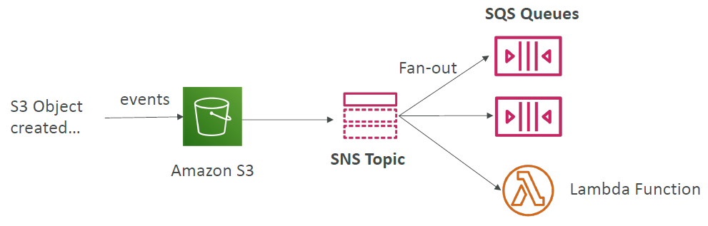
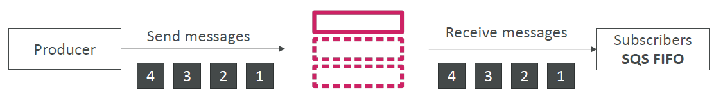
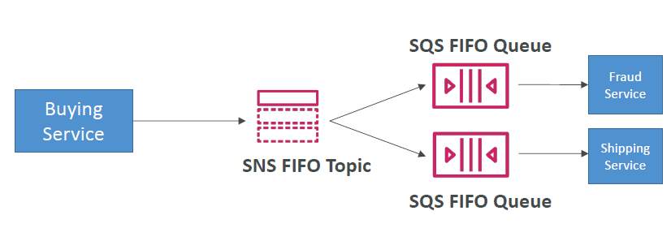

# AWS SNS

---

* The “event producer” only sends message to one SNS topic
* As many “event receivers” (subscriptions) as we want to listen to the SNS topic notifications
* Each subscriber to the topic will get all the messages (note: new feature to filter messages)
* Up to 12,500,000 subscriptions per topic
* 100,000 topics limit
### SNS integrates with a lot of AWS services
* Many AWS services can send data directly to SNS for notifications

### Amazon SNS – Security
* Encryption:
  * In-flight encryption using HTTPS API
  * At-rest encryption using KMS keys
  * Client-side encryption if the client wants to perform encryption/decryption itself
* Access Controls: IAM policies to regulate access to the SNS API
* SNS Access Policies (similar to S3 bucket policies)
  * Useful for cross-account access to SNS topics
  * Useful for allowing other services ( S3…) to write to an SNS topic
### Application: S3 Events to multiple queues

* For the same combination of: event type (e.g. object create) and prefix(e.g. images/) you can only have one S3 Event rule
* If you want to send the same S3 event to many SQS queues, use fan-out
### SNS – FIFO Topic

* FIFO = First In First Out (ordering of messages in the topic)
* Similar features as SQS FIFO:
  * Ordering by Message Group ID (all messages in the same group are ordered)
  * Deduplication using a Deduplication ID or Content Based Deduplication
* Can have SQS Standard and FIFO queues as subscribers
* Limited throughput (same throughput as SQS FIFO)
### SNS FIFO + SQS FIFO: Fan Out

* In case you need fan out + ordering + deduplication
