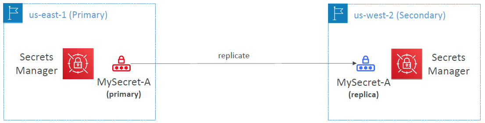

# AWS Secrets Manager

---
* Newer service, meant for storing secrets
* Capability to force rotation of secrets every X days
* Automate generation of secrets on rotation (uses Lambda)
* Integration with Amazon RDS (MySQL, PostgreSQL, Aurora)
* Secrets are encrypted using KMS
* Mostly meant for RDS integration
### AWS Secrets Manager – Multi-Region Secrets

* Replicate Secrets across multiple AWS Regions
* Secrets Manager keeps read replicas in sync with the primary Secret
* Ability to promote a read replica Secret to a standalone Secret
* Use cases: multi-region apps, disaster recovery strategies, multi-region DB…