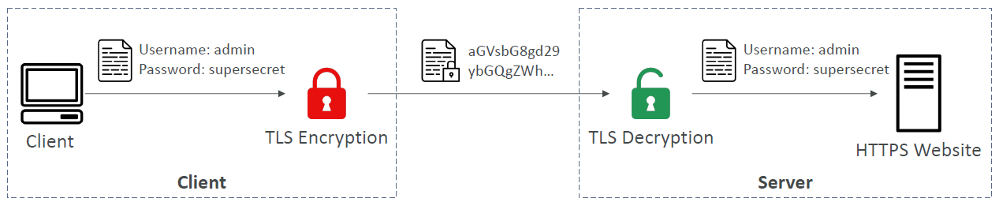
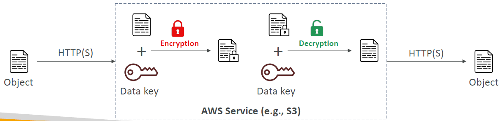

# AWS Security & Encryption

---
## Why encryption?
### Encryption in flight (TLS / SSL)**

* Data is encrypted before sending and decrypted after receiving
* TLS certificates help with encryption (HTTPS)
* Encryption in flight ensures no MITM (man in the middle attack) can happen
### Server-side encryption at rest

* Data is encrypted after being received by the server
* Data is decrypted before being sent
* It is stored in an encrypted form thanks to a key (usually a data key)
* The encryption / decryption keys must be managed somewhere, and the server must have access to it
### Client-side encryption
* Data is encrypted by the client and never decrypted by the server
* Data will be decrypted by a receiving client
* The server should not be able to decrypt the data
* Could leverage Envelope Encryption