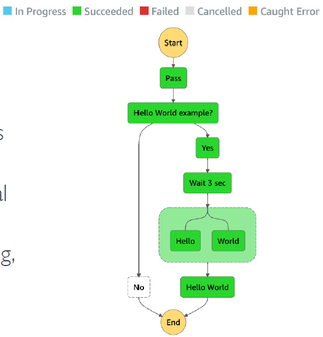

# AWS Step Function

---

* Build serverless visual workflow to orchestrate your Lambda functions
* Features: sequence, parallel, conditions, timeouts, error handling, …
* Can integrate with EC2, ECS, On-premises servers, API Gateway, SQS queues, etc…
* Possibility of implementing human approval feature
* Use cases: order fulfillment, data processing, web applications, any workflow