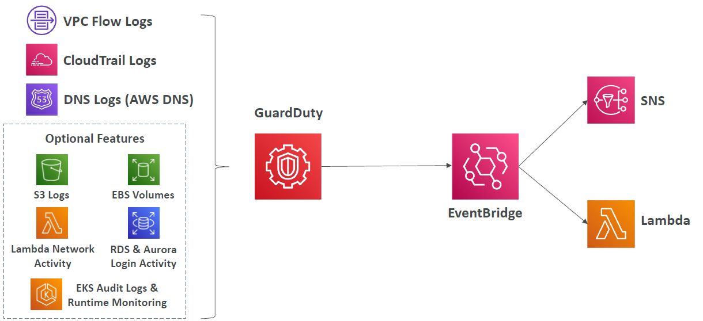

# AWS WAF 

---
### AWS WAF– Web Application Firewall
* Protects your web applications from common web exploits (Layer 7)
* Layer 7 is HTTP (vs Layer 4 is TCP/UDP)
* Deploy on
* Application Load Balancer
* API Gateway
* CloudFront
* AppSync GraphQL API
* Cognito User Pool
* Define Web ACL (Web Access Control List) Rules:
  * IP Set: up to 10,000 IP addresses – use multiple Rules for more IPs
  * HTTP headers, HTTP body, or URI strings Protects from common attack - SQL injection and Cross-Site Scripting (XSS)
  * Size constraints, geo-match (block countries)
  * Rate-based rules (to count occurrences of events) – for DDoS protection
* Web ACL are Regional except for CloudFront
* A rule group is a reusable set of rules that you can add to a web ACL
### WAF – Fixed IP while using WAF with a Load Balancer

* WAF does not support the Network Load Balancer (Layer 4)
* We can use Global Accelerator for fixed IP and WAF on the ALB

# AWS Shield

---
### AWS Shield: protect from DDoS attack
* DDoS: Distributed Denial of Service – many requests at the same time
* AWS Shield Standard:
  * Free service that is activated for every AWS customer
  * Provides protection from attacks such as SYN/UDP Floods, Reflection attacks and other layer 3/layer 4 attacks
* AWS Shield Advanced:
  * Optional DDoS mitigation service ($3,000 per month per organization)
  * Protect against more sophisticated attack on Amazon EC2, Elastic Load Balancing (ELB), Amazon CloudFront, AWS Global Accelerator, and Route 53
  * 24/7 access to AWS DDoS response team (DRP)
  * Protect against higher fees during usage spikes due to DDoS
  * Shield Advanced automatic application layer DDoS mitigation automatically creates, evaluates and deploys AWS WAF rules to mitigate layer 7 attacks
# AWS Firewall Manager

---
### AWS Firewall Manager
* Manage rules in all accounts of an AWS Organization
* Security policy: common set of security rules
  * WAF rules (Application Load Balancer, API Gateways, CloudFront)
  * AWS Shield Advanced (ALB, CLB, NLB, Elastic IP, CloudFront)
  * Security Groups for EC2, Application Load BAlancer and ENI resources in VPC
  * AWS Network Firewall (VPC Level)
  * Amazon Route 53 Resolver DNS Firewall
  * Policies are created at the region level
* Rules are applied to new resources as they are created (good for compliance) across all and future accounts in your Organization
### WAF vs. Firewall Manager vs. Shield
* WAF, Shield and Firewall Manager are used together for comprehensive protection
* Define your Web ACL rules in WAF
* For granular protection of your resources, WAF alone is the correct choice
* If you want to use AWS WAF across accounts, accelerate WAF configuration, automate the protection of new resources, use Firewall Manager with AWS WAF
* Shield Advanced adds additional features on top of AWS WAF, such as dedicated support from the Shield Response Team (SRT) and advanced reporting.
* If you’re prone to frequent DDoS attacks, consider purchasing Shield Advanced
### AWS Best Practices for DDoS Resiliency Edge Location Mitigation (BP1, BP3)
* BP1 – CloudFront
  * Web Application delivery at the edge
  * Protect from DDoS Common Attacks (SYN floods, UDP reflection…)
* BP1 – Global Accelerator
  * Access your application from the edge
  * Integration with Shield for DDoS protection
  * Helpful if your backend is not compatible with CloudFront
* BP3 – Route 53
  * Domain Name Resolution at the edge
  * DDoS Protection mechanism

# Amazon GuardDuty

---
### Amazon GuardDuty

* Intelligent Threat discovery to protect your AWS Account
* Uses Machine Learning algorithms, anomaly detection, 3rd party data
* One click to enable (30 days trial), no need to install software
* Input data includes:
  * CloudTrail Events Logs – unusual API calls, unauthorized deployments
    * CloudTrail Management Events – create VPC subnet, create trail, …
    * CloudTrail S3 Data Events – get object, list objects, delete object, …
  * VPC Flow Logs – unusual internal traffic, unusual IP address
  * DNS Logs – compromised EC2 instances sending encoded data within DNS queries
  * Optional Features – EKS Audit Logs, RDS & Aurora, EBS, Lambda, S3 Data Events…
* Can setup EventBridge rules to be notified in case of findings
* EventBridge rules can target AWS Lambda or SNS
* Can protect against CryptoCurrency attacks (has a dedicated “finding” for it)