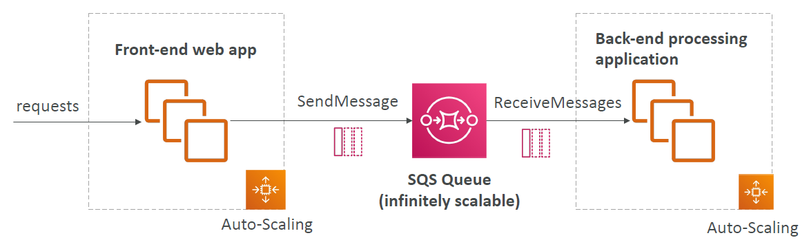
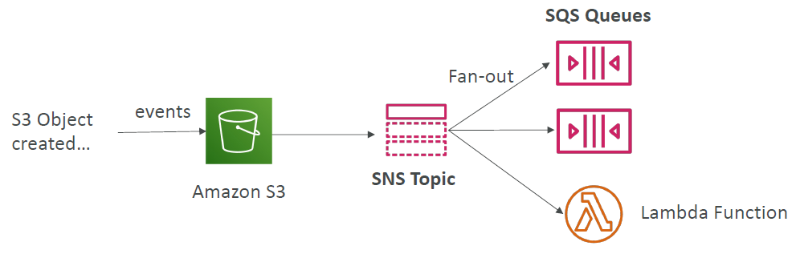

# Amazon SQS

---
### Standard Queue
* Oldest offering (over 10 years old)
* Fully managed service, used to decouple applications
* Attributes:
  * Unlimited throughput, unlimited number of messages in queue
  * Default retention of messages: 4 days, maximum of 14 days
  * Low latency (<10 ms on publish and receive)
  * Limitation of 256KB per message sent
* Can have duplicate messages (at least once delivery, occasionally)
* Can have out of order messages (best effort ordering)
### Producing Messages
* Produced to SQS using the SDK (SendMessage API)
* The message is persisted in SQS until a consumer deletes it
* Message retention: default 4 days, up to 14 days
* Example: send an order to be processed
  * Order id
  * Customer id
  * Any attributes you want
* SQS standard: unlimited throughput
### Consuming Messages

* Consumers (running on EC2 instances, servers, or AWS Lambda)…
* Poll SQS for messages (receive up to 10 messages at a time)
* Process the messages (example: insert the message into an RDS database)
* Delete the messages using the DeleteMessage API
### Multiple EC2 Instances Consumers

* Consumers receive and process messages in parallel
* At least once delivery
* Best-effort message ordering
* Consumers delete messages after processing them
* We can scale consumers horizontally to improve throughput of processing
### SQS with Auto Scaling Group (ASG)

### SQS to decouple between application tiers

### Security
* Encryption:
  * In-flight encryption using HTTPS API
  * At-rest encryption using KMS keys
  * Client-side encryption if the client wants to perform encryption/decryption itself
* Access Controls: IAM policies to regulate access to the SQS API
* SQS Access Policies (similar to S3 bucket policies)
  * Useful for cross-account access to SQS queues
  * Useful for allowing other services (SNS, S3…) to write to an SQS queue
### Message Visibility Timeout

* After a message is polled by a consumer, it becomes invisible to other consumers
* By default, the “message visibility timeout” is 30 seconds
* That means the message has 30 seconds to be processed
* After the message visibility timeout is over, the message is “visible” in SQS
* If a message is not processed within the visibility timeout, it will be processed twice
* A consumer could call the ChangeMessageVisibility API to get more time
* If visibility timeout is high (hours), and consumer crashes, re-processing will take time
* If visibility timeout is too low (seconds), we may get duplicates
### SQS - Long Polling
* When a consumer requests messages from the queue, it can optionally “wait” for messages to arrive if there are none in the queue
* This is called Long Polling
* LongPolling decreases the number of API calls made to SQS while increasing the efficiency and reducing latency of your application
* The wait time can be between 1 sec to 20 sec(20 sec preferable)
* Long Polling is preferable to Short Polling
* Long polling can be enabled at the queue level or at the API level using WaitTimeSeconds
### SQS – FIFO Queue

* FIFO = First In First Out (ordering of messages in the queue)
* Limited throughput: 300 msg/s without batching, 3000 msg/s with
* Exactly-once send capability (by removing duplicates)
* Messages are processed in order by the consumer
### SQS as a buffer to database writes

### SNS + SQS: Fan Out

* Push once in SNS, receive in all SQS queues that are subscribers
* Fully decoupled, no data loss
* SQS allows for: data persistence, delayed processing and retries of work
* Ability to add more SQS subscribers over time
* Make sure your SQS queue access policy allows for SNS to write
* Cross-Region Delivery: works with SQS Queues in other regions
### Application: S3 Events to multiple queues

* For the same combination of: event type (e.g. object create) and prefix(e.g. images/) you can only have one S3 Event rule
* If you want to send the same S3 event to many SQS queues, use fan-out