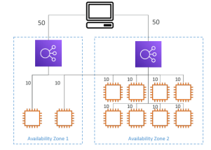

# EC2

---

* Amazon Elastic Compute Cloud (Amazon EC2) provides on-demand, scalable computing capacity in the Amazon Web Services (AWS) Cloud.
* EC2 stands for Amazon Elastic Compute Cloud.
* Is Infrastructure As A service
* Customer managed service
### Terms In EC2 
1. **Instances** : Virtual servers.
2. **Amazon Machine Images (AMIs)** : Preconfigured templates for our instances(CPU,RAM)
   * Amazon machine Image
   * AMI are built for a specific region (and can be copied across regions)
   *  A Public AMI:AWS provided
   *  Your own AMI: you make and maintain them yourself
   *  An AWS Marketplace AMI:an AMI someone else made (and potentially sell
3. **Instance types** : Various configurations of CPU, memory, storage, networking capacity, and graphics hardware for our instances.
4. **Key pairs** : Secure login information for our instances.
5. **Amazon EBS volumes** : Persistent storage volumes for our data 
6. **Security groups** : A virtual firewall that allows you to specify the protocols, ports, and source IP ranges that can reach your instances, and the destination IP ranges to which your instances can connect.
7. **Elastic IP addresses** : Static IPv4 addresses for dynamic cloud computing.
   
8. **Bootstrap script** : configure at first launch
### Instance Type
1. **General purpose**

   Great for a diversity of workloads such as web servers or code repositories
   
   Ex : t2.micro

   **Balance between:**
   * Compute
   * Memory
   * Networking
  

2. **Compute optimized**

   Great for compute-intensive tasks that require high performance
   * Batch processing workloads
   * Media transcoding
   * High performance web servers
   * High performance computing (HPC)
   * Scientific modelling & machine learning
   * Dedicated gaming servers

3. **Memory optimized**

   Fast performance for workloads that process large data sets in memory
   * High performance, relational/non-relational databases
   * Distributed web scale cache stores
   * In-memory databases optimized for BI (business intelligence)
   * Applications performing real-time processing of big unstructured data

4. **Storage optimized**

   Great for storage-intensive tasks that require high, sequential read and write access to large data sets on local storage
   * High frequency online transaction processing (OLTP) systems
   * Relational & NoSQL databases
   * Cache for in-memory databases (for example, Redis)
   * Data warehousing applications
   * Distributed file systems

### EC2 instance purchasing option
1. **On-demand**
   * short workload, predictable pricing, pay by second
   * Recommended for short-term and un-interrupted workloads,
2. Reserved instance
   * Up to 72% discount compared to On-demand
   * Reservation period 1-3year
   * Recommended for steady-state usage applications
   * You can buy and sell in the Reserved Instance Marketplace
3. Spot instance
   * Can get a discount of up to 90%compared to On-demand
   * Instances that you can “lose” at any point of time if your max price is less than the current spot price
   * The MOST cost-efficient instances in AWS
   * Batch jobs
   * Data analysis
   * Image processing
   * Any distributed workloads
   * Workloads with a flexible start and end time
   * Not suitable for critical jobs or databases
4. Dedicated hosts
   * A physical server with EC2 instance capacity fully dedicated to your use
### Classic Ports to know
* `22` = SSH (Secure Shell) -log into a Linux instance
* `21` = FTP (File Transfer Protocol) –upload files into a file share
* `22` = SFTP (Secure File Transfer Protocol) –upload files using SSH
* `80` = HTTP –access unsecured websites
* `443` = HTTPS –access secured websites
* `3389` = RDP (Remote Desktop Protocol) –log into a Windows instance

### EC2 In Public subnet

* The instance which is launched in public subnet
* Instance which is having both public and private IP address
* Using public IP address we can connect to instance based on type allowed security 
### EC2 In Private subnet

* The instance which is launched in private subnet
* Instance which is having private IP Address
* Using instance we directly can't connect to internet
### Launching Instance

>[!NOTE]
> 
> Don't configure IAM credential directly to Instance, instead store in security
### Scalability 
Scalability means that an application / system can handle greater loads by adapting.
#### There are two kinds of scalability:
1. Vertical Scalability
2. Horizontal Scalability (= elasticity)

**Vertical scalability**
* Vertically scalability means increasing the size of the instance
* Scaling that application vertically means running it on a t2.large
* Vertical scalability is very common for non distributed systems, such as a database.

Ex : RDS, ElastiCache are services that can scale vertically.

**Horizontal scalability**
* Horizontal Scalability means increasing the number of instances / systems for your application
* Horizontal scaling implies distributed systems.
* This is very common for web applications / modern applications
* Auto Scaling Group
* Load Balancer

### Availability
**High availability**
* High availability means running your application / system in at least 2 data centers (== Availability Zones)
* The high availability can be passive (for RDS Multi AZ for example)
* Auto Scaling Group multi AZ
* Load Balancer multi AZ

## Auto Scaling

* Creating/increasing the number of instance when load is increasing
* Auto-scaling uses launch template 
### The goal of an Auto Scaling Group (ASG) is to:
* Scale out (add EC2 instances) to match an increased load
* Scale in (remove EC2 instances) to match a decreased load
* Ensure we have a minimum and a maximum number of EC2 instances running
* Automatically register new instances to a load balancer
* Re-create an EC2 instance in case a previous one is terminated (ex: if unhealthy)
### Enable Auto scaling
1. **cloud watch alarms**
   * An alarm monitors a metric (such as Average CPU, or a custom metric)
   * We can create scale-out policies (increase the number of instances)
   * We can create scale-in policies (decrease the number of instances)
2. **Dynamic scaling policies**
   * **Target Tracking Scaling**
     * Most simple and easy to set-up
    
     Example: I want the average ASG CPU to stay at around 40%
   * **Simple / Step Scaling**
     * When a CloudWatch alarm is triggered (example CPU > 70%), then add 2 units
     * When a CloudWatch alarm is triggered (example CPU < 30%), then remove 1
   * **Scheduled Actions**
     * Anticipate a scaling based on known usage patterns

       Example: increase the min capacity to 10 at 5 pm on Fridays
3. Predictive scaling
   * Predictive scaling: continuously forecast load and schedule scaling ahead
### Scaling Cooldowns
* After a scaling activity happens, you are in the cooldown period (default 300 seconds)
* During the cooldown period, the ASG will not launch or terminate additional instances (to allow for metrics to stabilize)
* Advice: Use a ready-to-use AMI to reduce configuration time in order to be serving request faster and reduce the cooldown period
## Load Balancing

* Load Balances are servers that forward traffic to multiple servers (e.g., EC2 instances) downstream
>[!NOTE]
>
> Load Balancer works based on targets group
### Why use elastic load balancer
* Spread load across multiple downstream instances
* Expose a single point of access (DNS) to your application
* Seamlessly handle failures of downstream instances
* Do regular health checks to your instances
* Provide SSL termination (HTTPS) for your websites
* Enforce stickiness with cookies
* High availability across zones
* Separate public traffic from private e traffic
###  Types of load balancer in AWS
1. Application load balancer
2. Network load balancer
3. Gateway load balancer
#### Application load balancer

* 2016=> v2 – new generation
* Application load balancers is Layer 7 (HTTP)
* HTTP,  HTTPS, WebSocket
* Routing tables to different target groups:
  * Routing based on path in URL   (example.com/users & example.com/posts)
  * Routing based on hostname in URL  (one.example.com& other.example.com)
  * Routing based on Query String, Headers (example.com/users?id=123&order=false)
* ALB are a great fit for microservices & container-based application (example: Docker & Amazon ECS)
* Has a port mapping feature to redirect to a dynamic port in ECS

#### Network load balancer

* 2017=> v2- new generation
* TCP,  TLS (secure TCP), UDP
* Handle millions of request per seconds
* NLB are used for extreme performance, TCP or UDP traffic
* NLB has one static IP per AZ, and supports assigning Elastic IP (helpful for whitelisting specific IP)

#### Gate way load balancer
* 2020
* Operates at layer 3 (Network layer) –IP Protocol
* load balancers can be setup as internal (private) or external (public) ELBs
### Health check
* They enable the load balancer to know if instances it forwards traffic to are available to reply to requests
* The health check is done on a port and a route (/health is common)
* If the response is not 200 (OK), then the instance is unhealthy
###Sticky session
* It is possible to implement stickiness so that the same client is always redirected to the same instance behind a load balancer
* This works for Classic Load Balancer, Application Load Balancer, and Network Load Balancer
* For both CLB & ALB, the “cookie” used for stickiness has an expiration date you control
* Use case: make sure the user doesn’t lose his session data
1. **Application-based Cookies**
     * Custom cookie
       * Generated by the target
       * Can include any custom attributes required by the application
       * Cookie name must be specified individually for each target group
       * Don’t use AWSALB, AWSALBAPP, or AWSALBTG(reserved for use by the ELB)
     * Application cookie
       * Generated by the load balancer
       * Cookie name is AWSALBAPP
2. **Duration based cookies**
     * Cookie generated by the load balancer
     * Cookie name is AWSALB for ALB, AWSELB for CLB
#### Connection draining
* Deregistration Delay –for ALB & NLB
* Stops sending new requests to the EC2 instance which is de-registering
* Between 1 and 3600 seconds (default: 300 seconds)
### Cross-zone load balancing
1. With Cross zone load balancing

   * each load balancer instance distributes evenly across all registered instances in all AZ
   * Enabled by default (can be disabled at the Target Group level) for ALB
   * No charges for inter AZ data to ALB
   * Disabled by default for NLB and GLB
   * You pay charges ($) for inter AZ data if enabled to NLB and GLB

2. Without cross zone load balancing

   * Requests are distributed in the instances of the node of the Elastic Load Balancer
### SSL/TLS

* An SSL Certificate allows traffic between your clients and your load balancer to be encrypted in transit (in-flight encryption)
* SSL refers to Secure Sockets Layer, used to encrypt connections
* TLS refers to Transport Layer Security, which is a newer version
* Public SSL certificates are issued by Certificate Authorities (CA)
* SSL certificates have an expiration date (you set) and must be renewed
* You can manage certificates using ACM (AWS Certificate Manager)
* Clients can use SNI (Server Name Indication) to specify the hostname they reach
* Ability to specify a security policy to support older versions of SSL / TLS (legacy clients)
#### SNI
* Server Name Indication
* SNI solves the problem of loading multiple SSL certificates onto one web server(to serve multiple websites)
* It’s a “newer” protocol, and requires the client to indicate the hostname of the target server in the initial SSL handshake
* The server will then find the correct certificate, or return the default one
## EC2 Storage
### 1. EBS

* EBS stands for Elastic block store
* EBS (Elastic Block Store) Volume is a network drive you can attach to your instances while they run
* It allows your instances to persist data, even after their termination
* They are bound to a specific availability zone
* An EBS Volume in us-east-1a cannot be attached to us-east-1b
* It can be detached from an EC2 instance and attached to another one quickly
>[!NOTE]
>
> Root EBS volume will delete by default after instance termination
#### EBS Volume Behavior
* It’s a network drive (i.e. not a physical drive)
  * It uses the network to communicate the instance, which means there might be a bit of latency
  * It can be detached from an EC2 instance and attached to another one quickly
* It’s locked to an Availability Zone (AZ)
  * An EBS Volume in us-east-1a cannot be attached to us-east-1b
  * To move a volume across, you first need to snapshot it
* Have a provisioned capacity (size in GBs, and IOPS)
  * You get billed for all the provisioned capacity
  * You can increase the capacity of the drive over time
* Controls the EBS behaviour when an EC2 instance terminates
  * By default, the root EBS volume is deleted (attribute enabled)
  * By default, any other attached EBS volume is not deleted (attribute disabled)
#### EBS Volume Type

* gp2 / gp3 (SSD): General purpose SSD volume that balances price and performance for a wide variety of workloads  
* io1 / io2 (SSD): Highest-performance SSD volume for mission-critical low-latency or high-throughput workloads
* st1 (HDD): Low cost HDD volume designed for frequently accessed, through put intensive workloads
* sc1 (HDD): Lowest cost HDD volume designed for less frequently accessed workloads
### EBS Snapshot

* Make a backup (snapshot) of your EBS volume at a point in time
* Not necessary to detach volume to do snapshot, but recommended
* Can copy snapshots across AZ or Region

### 2. Instance store
* high-performance hardware disk, use EC2 Instance Store
* Better I/O performance
* EC2 Instance Store lose their storage if they’re stopped (ephemeral)
### 3. EFS

* Elastic file system
* Managed NFS (network file system) that can be mounted on many EC2
* EFS works with EC2 instances in multi-AZ
* Highly available, scalable, expensive (3x gp2), pay per use

