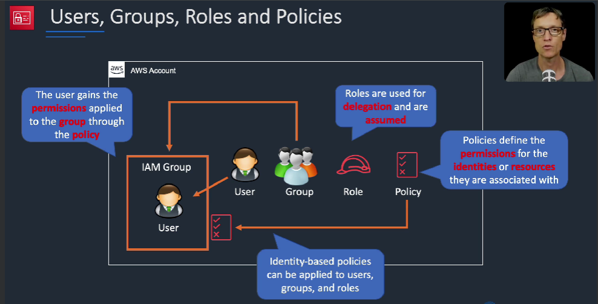
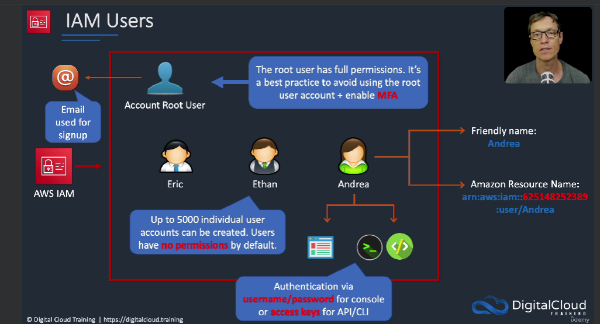
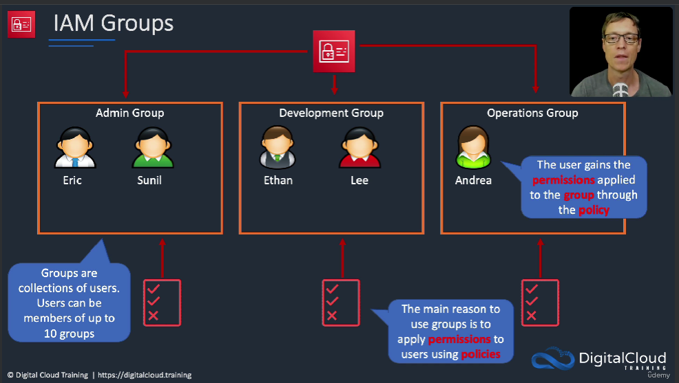
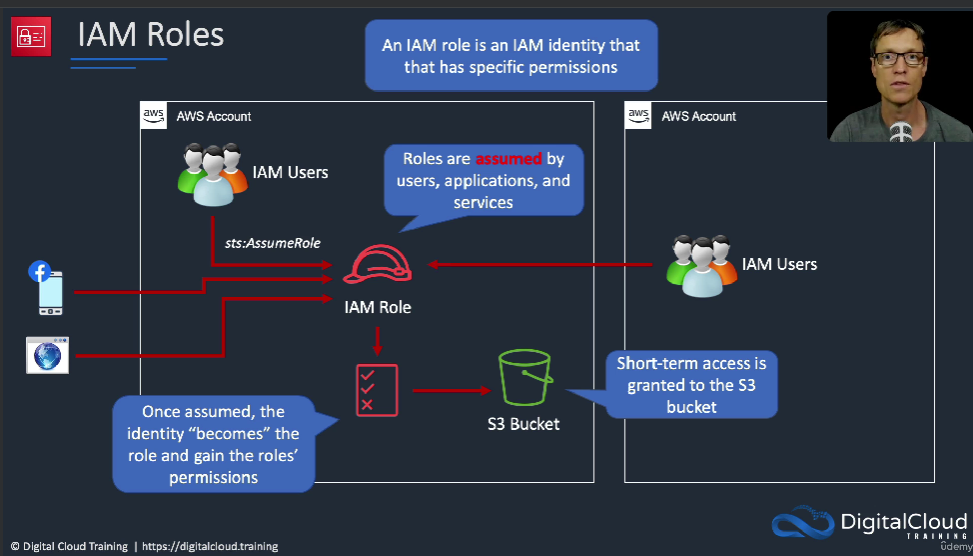
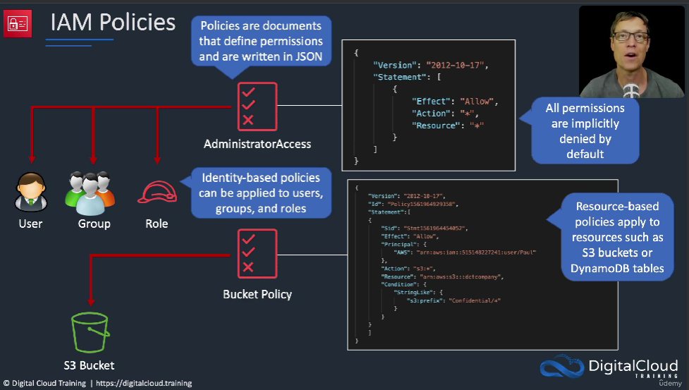
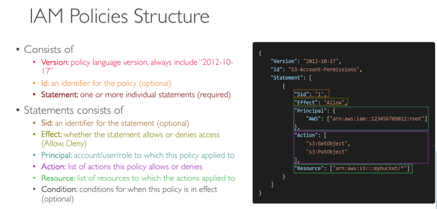
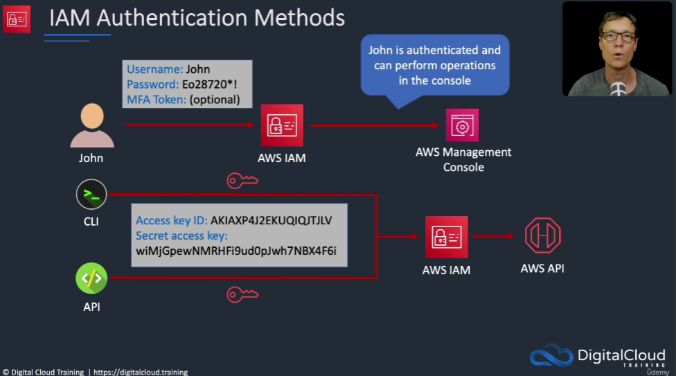
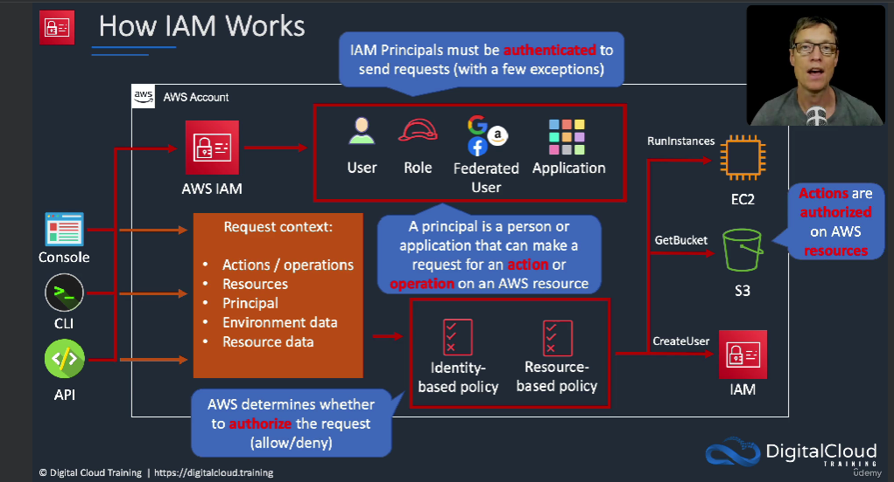
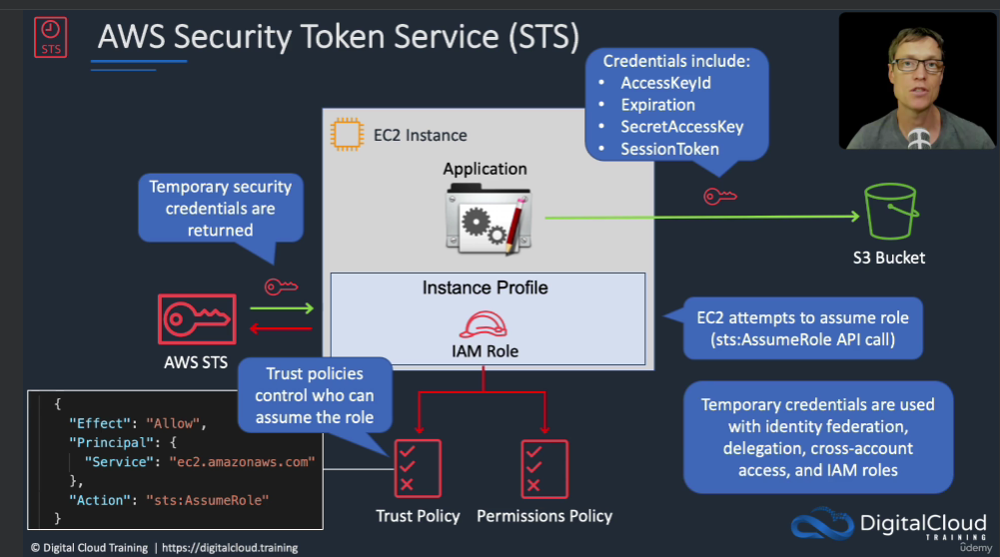

# IAM

---
* Identity and access management
* It is global service
* It is hosted in Virginia region
* All endpoints reaches to N. Virginia region
* IAM is AWS Manged services
* IAM is direct or indirect integration with all other services

### IAM Users
* Users are people within your organization

### IAM Groups
* Identity for collection of relative users
* Groups only contain users, not other groups
* Users don’t have to belong to a group, and user can belong to multiple groups

### IAM Roles
* Some AWS service will need to perform actions on your behalf
* Identity for AWS Services or External or federated users
* These policies define the permissions of the users
* In AWS you apply the `least privilege principle`: don’t give more permissions than a user needs

### Policy
* Policy are used to provide AWS service access

### IAM Password 
* Strong passwords = higher security for your account
* In AWS, you can setup a password policy:
  * Set a minimum password length
  * Require specific character types:
    * including uppercase letters
    * lowercase letters
    * numbers
    * non-alphanumeric characters
* Allow all IAM users to change their own passwords
* Require users to change their password after some time (password expiration)
* Prevent password re-use

>[!NOTE]
> 
>You want to protect your Root Accounts and IAM users add MFA(password + MFA)
### HOW IAM Works

### STS
Security Token Service
* Which will allow to EC2 to access the S3 bucket
