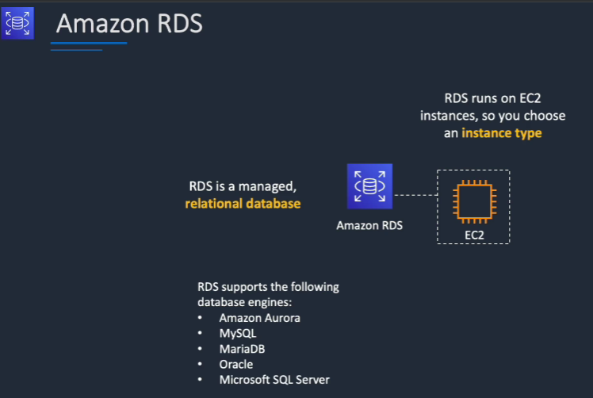
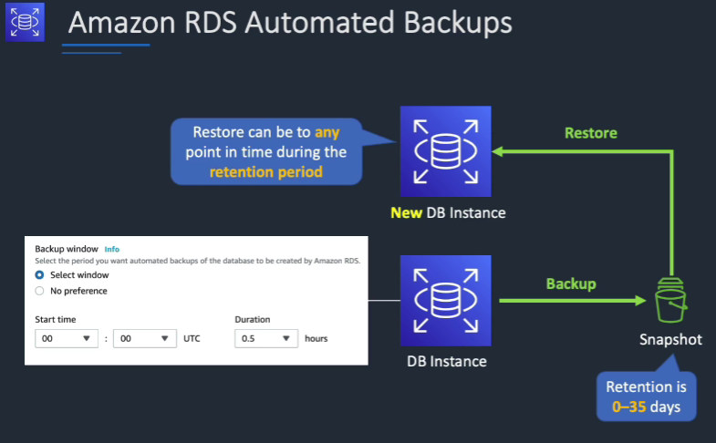
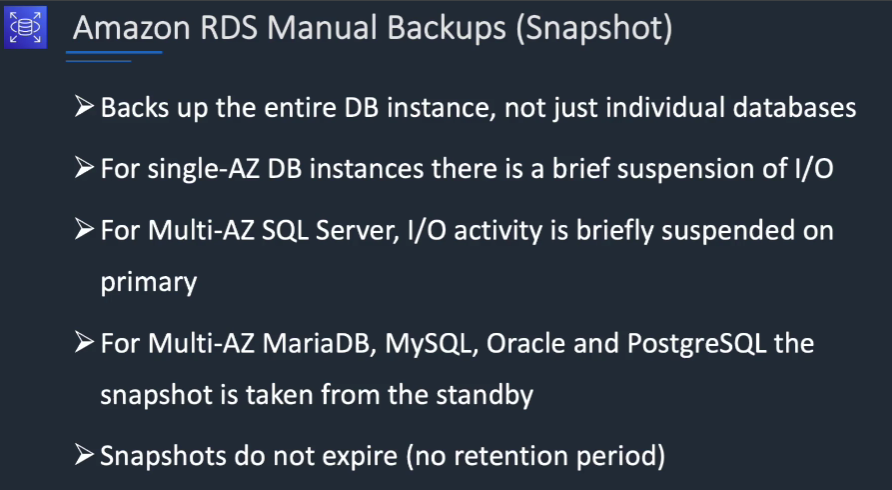
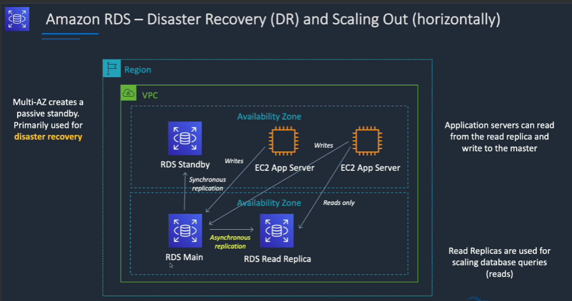
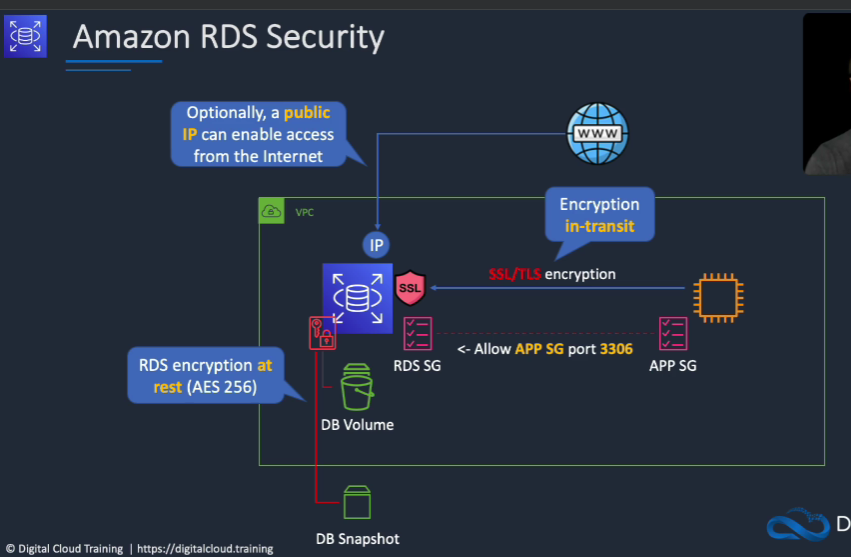

# RDS

---
### Basics of data and database
#### 1. DATA
* **Structured Data and Schema:**

    * Structured data is organized information that follows a predefined format.
    * A schema defines the structure and organization of data within a database, exemplified by tables in a relational database.
    * In Amazon RDS (Relational Database Service), users can define a schema for their databases, specifying tables, columns, and relationships (Amazon RDS - Working with DB Instances).
* **Semi-Structured Data:** 
  * Semi-structured data is organized but doesn't strictly adhere to a schema, allowing for varied attributes.
  * Products with diverse attributes, unlike the uniform attributes of books in a relational database.
  * AWS DynamoDB: Suited for semi-structured data and scenarios requiring high performance and low latency (Amazon DynamoDB - Data Model). 
* **Unstructured Data:** 
  * Unstructured data lacks a predefined organization, as seen in file systems or S3 buckets.
  * Objects in an S3 bucket or files in a computer folder.
  * Searching and organizing unstructured data can be more challenging compared to structured or semi-structured data.
#### 2. Database
**Relational Databases:**
* Relational databases organize data into tables with predefined relationships and use SQL (Structured Query Language) for querying.
* Example: Microsoft SQL, Oracle, MySQL, Postgres, Aurora, and MariaDB.
* Interconnected Tables: Tables in a relational database are linked through relationships, often established using foreign keys pointing to primary keys.
* Relational databases use indexes to improve query performance (Amazon RDS - Working with a MySQL DB Instance).

##### Structured Query Language (SQL):
* SQL is a language used to interact with relational databases, enabling the retrieval and manipulation of data.
* Relational databases support complex queries, including joins, to retrieve data from multiple related tables.
* Amazon RDS supports SQL-based interactions with various relational database engines (Amazon RDS - Using SQL with a DB Instance).

##### Non-relational Databases (NoSQL):
* NoSQL databases, such as AWS DynamoDB, are designed for semi-structured and unstructured data.
* NoSQL Meaning: NoSQL stands for "not only SQL."
* Semi-Structured Data: NoSQL databases are suitable for data that doesn't neatly fit into a schema, allowing for more flexibility in attribute definitions.
* Amazon DynamoDB: Ideal for big data applications with high performance and low latency requirements (Amazon DynamoDB Documentation).

## RDS

* RDS stands for Relational Database Service
* It’s a managed DB service for Data Base use SQL as a query language.
* It allows you to create databases in the cloud that are managed by AWS
  * Postgres
  * MySQL
  * MariaDB
  * Oracle
  * Microsoft SQL Server
  * Aurora (AWS Proprietary database)
* Helps you increase storage on your RDS DB instance dynamically
* Useful for applications with unpredictable workloads
* Supports all RDS database engines (MariaDB, MySQL, PostgreSQL, SQL Server, Oracle)
* RDS instances run within a VPC with a private subnet, allowing users to control networking configurations.
* Underlying storage uses Amazon Elastic Block Store (EBS) volumes, similar to EC2.
* CloudWatch is utilized for monitoring RDS instances, providing performance charts, generating alarms, and enabling automated actions based on alarms.

### Advantages on deploying RDS on EC2

* Automated provisioning, OS patching
* Continuous backups and restore to specific timestamp (Point in Time Restore)!

* Monitoring dashboards
* Read replicas for improved read performance
* Multi AZ setup for DR (Disaster Recovery)
* Maintenance windows for upgrades
* Scaling capability (vertical and horizontal)
* Storage backed by EBS (gp2 or io1)

### Read replica-> read scalability

* Up to 15 Read Replicas
* Within AZ, Cross AZ or Cross Region
* Replication is ASYNC, so reads are eventually consistent
* Replicas can be promoted to their own DB
* Applications must update the connection string to leverage read replicas
* For RDS Read Replicas within the same region, you don’t pay that fee
* Fail-over in case of loss of AZ, loss of network, instance or storage failure
### RDS security

## AWS Aurora
* Aurora is a proprietary technology from AWS (not open sourced)
* Postgres and MySQL are both supported as Aurora DB (that means your drivers will work as if Aurora was a Postgres or MySQL database)
* Aurora is “AWS cloud optimized” and claims 5x performance improvement over MySQL on RDS, over 3x the performance of Postgres on RDS
* Aurora storage automatically grows in increments of 10GB, up to 128 TB.
* Aurora can have up to 15 replicas and the replication process is faster than MySQL (sub 10 ms replica lag)
* Failover in Aurora is instantaneous. It’s HA (High Availability) native.
* Aurora costs more than RDS (20% more) – but is more efficient
* One Aurora Instance takes writes (master)
* Support for Cross Region Replication