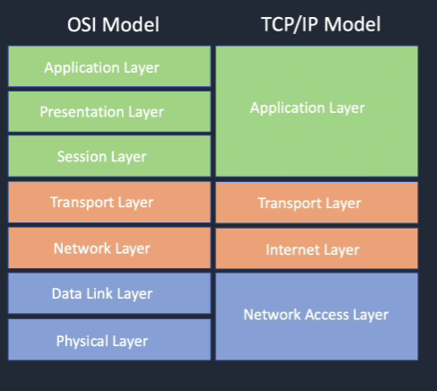

# VPC

---
* Virtual private cloud
* Region specific

### Two types of VPC
1. Default VPC •
   * One per region
   * All network components setup by AWS
   * By default all the subnets are public
2. Custom VPC
   * Can be more than one per region
   * Customer must create and manage all the components setup

## OSI Model

## VPC Components

* CIDR
* Internet gateway
* Router
* Subnet
* IP
* NAT Gateway
* NACL Network Access Control List
* Security group
* Port

### CIDR
* Classless Inter Domain Routing

Ex : 10.200.0.0/16
>[!NOTE]
> 
>* Maximum VPC netmask size prefix /16 (65536 IPs),(2^16)
>* Minimum VPC netmask size prefix /28 (16 IPs),(2^4)
### Internet gateway
* Highly available VPC component that allows communication between your VPC and the internet.
* It supports IPv4 and IPv6 traffic.
### Router
* A router is a device that connects two or more packet-switched networks or subnetworks.
  1. Public 
     * Route which is attached to public subnets
  2. Private
     * Route which is attached to private subnets
### Subnet
Subnets are nothing but Availability zones in region

1. Public subnet
   * If a subnet is associated with a route table that has a route to an internet gateway, it's known as a public subnet.
2. Private subnet
   * If a subnet is associated with a route table that does not have a route to an internet gateway,
### IP
* Internet Protocol (IP) address is the unique identifying number assigned to every device connected to the internet.
### NAT Gateway
* Interact private subnet to Internet using NAT Gateway

>[!Note]
>
> NAT Gateway required elastic public IP Address
* NAT Instance used to connect 

* NAT Instance vs NAT Gateway

### NACL
* Internet Protocol (IP) address is the unique identifying number assigned to every device connected to the internet.
  
* NACL Security rule
  
### Security Group
* A security group controls the traffic that is allowed to reach and leave the Instance

  Security group rule by default stateful

### Port
* Which will allow internet to servers 

### STEPS TO create VPC
1. Create a new VPC with CIDR 10.200.0.0/16
2. Create Internet Gateway (IGW) and Associate with VPC
3. Create a Public subnet 10.200.0.0/24. Enable auto assign public ip.
4. Create a Private subnet 10.200.1.0/24.
5. Create 2 security groups. For Public EC2 allow SSH from your ip. For Private EC2, allow SSH and, ICMP IPv4 All traffic from VPC CIDR 10.200.0.0/16
6. With previously created ssh key, Launch an EC2 instance (A) in Public Subnet. Instance should have Public IP and Private IP.
7. Launch other EC2 instance (B) in private subnet. Instance should have only Private IP.
8. Connect to EC2-A over Public IP using SSH from your workstation
9. Create your SSH key file on EC2-A (.pem), modify permissions to 600 10. SSH from EC2-A to EC2-B over EC2-B private IP
   Private subnet to internet word

### VPC Peering
A VPC peering connection is a networking connection between two VPCs that enables you to route traffic between them using private IPv4 addresses or IPv6 addresses.

### VPC Endpoints
* A VPC endpoint enables customers to privately connect to supported AWS services 
* VPC endpoint services powered by AWS PrivateLink.
* VPC endpoints are virtual devices. They are horizontally scaled, redundant, and highly available
#### There are two types of VPC endpoints
1. interface endpoints

   * Interface endpoints enable connectivity to services over AWS PrivateLink.
2. gateway endpoints

   * A gateway endpoint targets specific IP routes in an Amazon VPC route table, in the form of a prefix-list, used for traffic destined to Amazon DynamoDB or Amazon Simple Storage Service (Amazon S3).